作者：罗天，怀玉，刘宏宇，刘军

## 目录
+ [1. 引言与概述](https://aliyuque.antfin.com/ken.lj/qt1o6i/uggl6bcskhg5u0iq?singleDoc#1-引言与概述)
+ [2. 核心架构与设计理念](https://aliyuque.antfin.com/ken.lj/qt1o6i/uggl6bcskhg5u0iq?singleDoc#2-核心架构与设计理念)
+ [3. 核心概念深度解析](https://aliyuque.antfin.com/ken.lj/qt1o6i/uggl6bcskhg5u0iq?singleDoc#3-核心概念深度解析)
+ [4. 预定义组件与工具箱](https://aliyuque.antfin.com/ken.lj/qt1o6i/uggl6bcskhg5u0iq?singleDoc#4-预定义组件与工具箱)
+ [5. 高级特性与扩展能力](https://aliyuque.antfin.com/ken.lj/qt1o6i/uggl6bcskhg5u0iq?singleDoc#5-高级特性与扩展能力)
+ [6. 快速开始与实战指南](https://aliyuque.antfin.com/ken.lj/qt1o6i/uggl6bcskhg5u0iq?singleDoc#6-快速开始与实战指南)

---

## 1. 引言与概述
### 1.1 Spring AI Alibaba Graph 概述
Spring AI Alibaba Graph 是社区核心实现之一，也是整个框架在设计理念上区别于 Spring AI 只做底层原子抽象的地方，Spring AI Alibaba 期望帮助开发者更容易的构建智能体应用。基于 Graph 开发者可以构建工作流、多智能体应用。

Spring AI Alibaba Graph 在设计理念上借鉴 LangGraph，因此在一定程度上可以理解为是 Java 版的 LangGraph 实现，社区在此基础上增加了大量预置 Node、简化了 State 定义过程等，让开发者更容易编写对等低代码平台的工作流、多智能体等。

### 1.2 核心特性与优势
相比传统的AI应用开发方式，Spring AI Alibaba Graph具有以下核心优势：

#### Java生态深度集成
+ **Spring原生支持**：完整的依赖注入、配置管理、监控观测
+ **高并发处理**：Java天然的多线程优势，支持高并发场景

#### 丰富的预置组件
+ **15+ 预定义节点类型**：QuestionClassifierNode、LlmNode、ToolNode、KnowledgeRetrievalNode等
+ **多种Agent模式**：内置React、Reflection、Supervisor等智能体模式
+ **简化的State管理**：统一的状态定义和合并策略

#### 声明式API设计
+ **类似LangGraph的API**：Java开发者更容易上手
+ **链式调用**：简洁的流式API，代码更加优雅
+ **条件分支**：支持复杂的条件逻辑和并行处理

#### 生产级特性
+ **观测性支持**：完整的指标收集、链路追踪
+ **容错机制**：支持检查点、状态恢复、错误处理
+ **人机协作**：Human-in-the-loop支持，支持修改状态、恢复执行


## 快速开始：客户评价分类系统
让我们通过一个具体示例了解Spring AI Alibaba Graph的使用方式。这个示例展示了如何构建一个客户评价分类系统：

### 系统架构
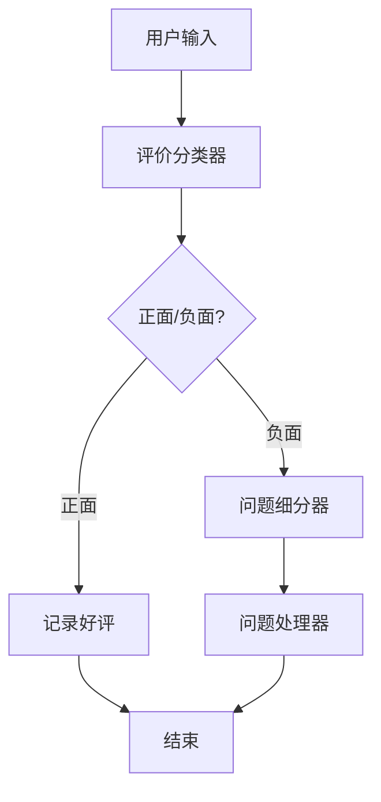
```mermaid
graph TD
    A[用户输入] --> B[评价分类器]
    B --> C{正面/负面?}
    C -->|正面| D[记录好评]
    C -->|负面| E[问题细分器]
    E --> F[问题处理器]
    D --> G[结束]
    F --> G
```

### 核心代码实现
```java
@Configuration
public class CustomerServiceWorkflow {
    
    @Bean
    public StateGraph customerServiceGraph(ChatModel chatModel) {
        ChatClient chatClient = ChatClient.builder(chatModel)
            .defaultAdvisors(new SimpleLoggerAdvisor())
            .build();
        
        // 评价分类器 - 区分正面/负面评价
        QuestionClassifierNode feedbackClassifier = QuestionClassifierNode.builder()
            .chatClient(chatClient)
            .inputTextKey("input")
            .outputKey("classifier_output")
            .categories(List.of("positive feedback", "negative feedback"))
            .build();
        
        // 问题细分器 - 对负面评价进行细分
        QuestionClassifierNode specificQuestionClassifier = QuestionClassifierNode.builder()
            .chatClient(chatClient)
            .inputTextKey("input")
            .outputKey("classifier_output")
            .categories(List.of("after-sale service", "transportation", "product quality", "others"))
            .build();
        
        // 状态工厂定义 - 简化的状态管理
        KeyStrategyFactory stateFactory = () -> {
            Map<String, KeyStrategy> strategies = new HashMap<>();
            strategies.put("input", new ReplaceStrategy());
            strategies.put("classifier_output", new ReplaceStrategy());
            strategies.put("solution", new ReplaceStrategy());
            return strategies;
        };
        
        // 构建工作流 - 声明式API
        return new StateGraph("客户服务评价处理", stateFactory)
            .addNode("feedback_classifier", node_async(feedbackClassifier))
            .addNode("specific_question_classifier", node_async(specificQuestionClassifier))
            .addNode("recorder", node_async(new RecordingNode()))
            .addEdge(START, "feedback_classifier")
            .addConditionalEdges("feedback_classifier",
                edge_async(new FeedbackQuestionDispatcher()),
                Map.of("positive", "recorder", "negative", "specific_question_classifier"))
            .addEdge("recorder", END);
    }
}
```

以上代码只展示了图结构（StateGraph）的构建，具体的代码实现您可以关注**spring-ai-alibaba-example**仓库：[spring-ai-alibaba-example](https://github.com/springaialibaba/spring-ai-alibaba-examples/tree/main/spring-ai-alibaba-graph-example)

这个示例展示了Spring AI Alibaba Graph的核心特性：

+ **预置组件**：使用QuestionClassifierNode快速实现分类功能
+ **简化状态管理**：通过KeyStrategyFactory统一管理状态
+ **声明式API**：链式调用构建复杂工作流
+ **Spring Boot集成**：通过@Configuration和@Bean完成依赖注入


## 2. 核心架构与设计理念
### 2.1 整体数据流转架构
Spring AI Alibaba Graph采用工作流模型，整个框架的数据流转遵循**"构建→编译→执行"**的三阶段模式：

#### 2.1.1 完整数据流转图
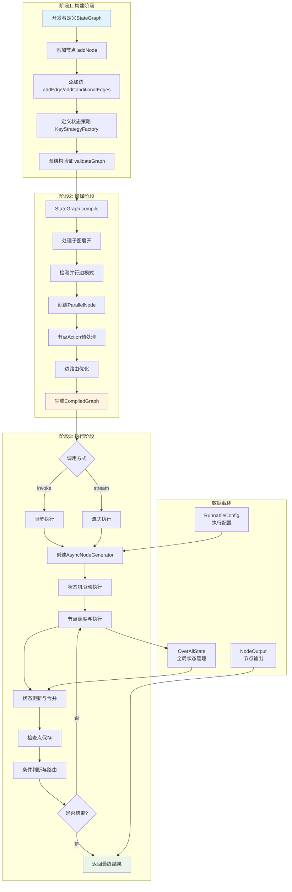
```mermaid
flowchart TD
    subgraph "阶段1: 构建阶段"
        A[开发者定义StateGraph] --> B[添加节点 addNode]
        B --> C[添加边 addEdge/addConditionalEdges]
        C --> D[定义状态策略 KeyStrategyFactory]
        D --> E[图结构验证 validateGraph]
    end
    
    subgraph "阶段2: 编译阶段"
        E --> F[StateGraph.compile]
        F --> G[处理子图展开]
        G --> H[检测并行边模式]
        H --> I[创建ParallelNode]
        I --> J[节点Action预处理]
        J --> K[边路由优化]
        K --> L[生成CompiledGraph]
    end
    
    subgraph "阶段3: 执行阶段"
        L --> M{调用方式}
        M -->|invoke| N[同步执行]
        M -->|stream| O[流式执行]
        
        N --> P[创建AsyncNodeGenerator]
        O --> P
        
        P --> Q[状态机驱动执行]
        Q --> R[节点调度与执行]
        R --> S[状态更新与合并]
        S --> T[检查点保存]
        T --> U[条件判断与路由]
        U --> V{是否结束?}
        V -->|否| R
        V -->|是| W[返回最终结果]
    end
    
    subgraph "数据载体"
        X[OverAllState<br/>全局状态管理]
        Y[RunnableConfig<br/>执行配置]
        Z[NodeOutput<br/>节点输出]
    end
    
    R --> X
    X --> S
    Y --> P
    Z --> W
    
    style A fill:#e1f5fe
    style L fill:#fff3e0
    style W fill:#e8f5e8
```

#### 2.1.2 核心执行流程详解
**数据流转的核心理念**：整个框架围绕**OverAllState**这个数据载体进行流转，每个节点都是状态的转换器，通过**AsyncNodeGenerator**这个状态机来驱动整个流程的执行。

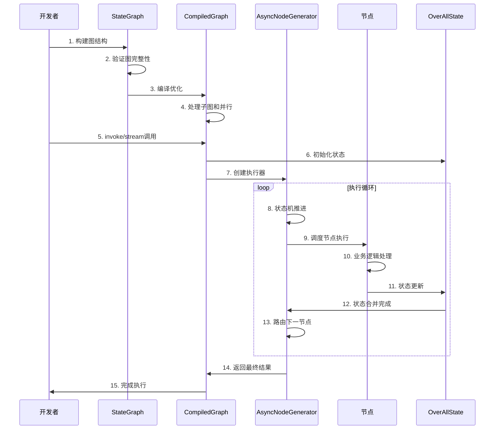
```mermaid
sequenceDiagram
    participant Dev as 开发者
    participant SG as StateGraph
    participant CG as CompiledGraph
    participant ANG as AsyncNodeGenerator
    participant Node as 节点
    participant State as OverAllState
    
    Dev->>SG: 1. 构建图结构
    SG->>SG: 2. 验证图完整性
    SG->>CG: 3. 编译优化
    CG->>CG: 4. 处理子图和并行
    
    Dev->>CG: 5. invoke/stream调用
    CG->>State: 6. 初始化状态
    CG->>ANG: 7. 创建执行器
    
    loop 执行循环
        ANG->>ANG: 8. 状态机推进
        ANG->>Node: 9. 调度节点执行
        Node->>Node: 10. 业务逻辑处理
        Node->>State: 11. 状态更新
        State->>ANG: 12. 状态合并完成
        ANG->>ANG: 13. 路由下一节点
    end
    
    ANG->>CG: 14. 返回最终结果
    CG->>Dev: 15. 完成执行
```

#### 2.1.3 关键数据结构流转
**StateGraph → CompiledGraph转换**：


**AsyncNodeGenerator执行机制**：

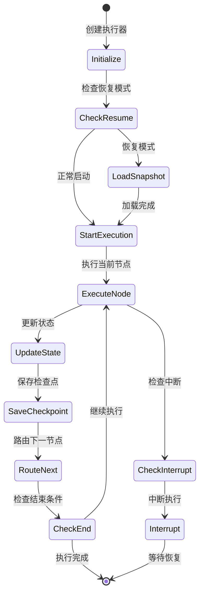
```mermaid
stateDiagram-v2
    [*] --> Initialize: 创建执行器
    Initialize --> CheckResume: 检查恢复模式
    CheckResume --> LoadSnapshot: 恢复模式
    CheckResume --> StartExecution: 正常启动
    LoadSnapshot --> StartExecution: 加载完成
    
    StartExecution --> ExecuteNode: 执行当前节点
    ExecuteNode --> UpdateState: 更新状态
    UpdateState --> SaveCheckpoint: 保存检查点
    SaveCheckpoint --> RouteNext: 路由下一节点
    RouteNext --> CheckEnd: 检查结束条件
    CheckEnd --> ExecuteNode: 继续执行
    CheckEnd --> [*]: 执行完成
    
    ExecuteNode --> CheckInterrupt: 检查中断
    CheckInterrupt --> Interrupt: 中断执行
    Interrupt --> [*]: 等待恢复
```

### 2.2 整体架构设计
基于上述数据流转机制，Spring AI Alibaba Graph的整体架构设计具有以下特点：

+ **清晰的执行流程**：每个节点代表一个处理步骤，边表示数据流向
+ **灵活的条件分支**：支持根据状态动态选择执行路径
+ **并行处理能力**：多个节点可以并行执行，提高处理效率
+ **状态可追溯**：完整的状态变化历史，便于调试和监控

**架构核心理念**：Spring AI Alibaba Graph将复杂的AI任务分解为可组合的原子操作，每个节点专注于单一职责，通过状态驱动的方式实现节点间的协调。这种设计让开发者可以像搭积木一样构建复杂的AI应用，既保证了系统的可维护性，又提供了足够的灵活性。

#### 2.2.1 系统架构总览
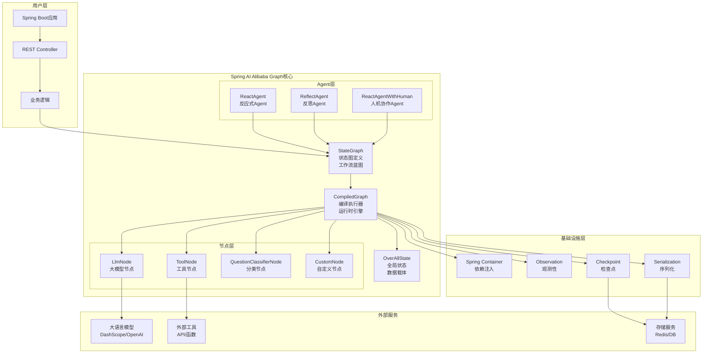
```mermaid
graph TB
    subgraph "用户层"
        U1[Spring Boot应用]
        U2[REST Controller]
        U3[业务逻辑]
    end
    
    subgraph "Spring AI Alibaba Graph核心"
        SG[StateGraph<br/>状态图定义<br/>工作流蓝图]
        CG[CompiledGraph<br/>编译执行器<br/>运行时引擎]
        OS[OverAllState<br/>全局状态<br/>数据载体]
        
        subgraph "节点层"
            N1[LlmNode<br/>大模型节点]
            N2[ToolNode<br/>工具节点]
            N3[QuestionClassifierNode<br/>分类节点]
            N4[CustomNode<br/>自定义节点]
        end
        
        subgraph "Agent层"
            A1[ReactAgent<br/>反应式Agent]
            A2[ReflectAgent<br/>反思Agent]
            A3[ReactAgentWithHuman<br/>人机协作Agent]
        end
    end
    
    subgraph "基础设施层"
        SC[Spring Container<br/>依赖注入]
        OB[Observation<br/>观测性]
        CP[Checkpoint<br/>检查点]
        SZ[Serialization<br/>序列化]
    end
    
    subgraph "外部服务"
        LLM[大语言模型<br/>DashScope/OpenAI]
        TOOL[外部工具<br/>API/函数]
        STORE[存储服务<br/>Redis/DB]
    end
    
    U1 --> U2
    U2 --> U3
    U3 --> SG
    SG --> CG
    CG --> OS
    CG --> N1
    CG --> N2
    CG --> N3
    CG --> N4
    A1 --> SG
    A2 --> SG
    A3 --> SG
    
    CG --> SC
    CG --> OB
    CG --> CP
    CG --> SZ
    
    N1 --> LLM
    N2 --> TOOL
    CP --> STORE
    SZ --> STORE
```

#### 2.2.2 StateGraph构建流程
**StateGraph是工作流的蓝图设计器**，它负责定义整个工作流的结构和执行逻辑，就像建筑师绘制建筑图纸一样。通过声明式的API，开发者可以轻松定义节点、边和状态管理策略，最终编译成可执行的CompiledGraph。

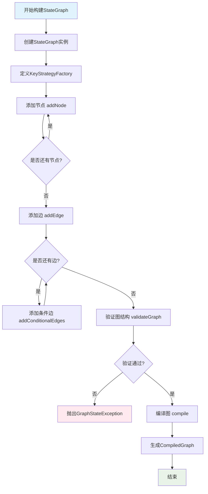
```mermaid
flowchart TD
    A[开始构建StateGraph] --> B[创建StateGraph实例]
    B --> C[定义KeyStrategyFactory]
    C --> D[添加节点 addNode]
    D --> E{是否还有节点?}
    E -->|是| D
    E -->|否| F[添加边 addEdge]
    F --> G{是否还有边?}
    G -->|是| H[添加条件边 addConditionalEdges]
    H --> G
    G -->|否| I[验证图结构 validateGraph]
    I --> J{验证通过?}
    J -->|否| K[抛出GraphStateException]
    J -->|是| L[编译图 compile]
    L --> M[生成CompiledGraph]
    M --> N[结束]
    
    style A fill:#e1f5fe
    style N fill:#e8f5e8
    style K fill:#ffebee
```

**关键设计思想**：StateGraph采用了"先定义后执行"的模式，将工作流的结构定义与实际执行分离，这样可以在编译时进行各种验证和优化，确保运行时的稳定性和高效性。

#### 2.2.3 CompiledGraph执行流程
**CompiledGraph是工作流的运行时引擎**，它将StateGraph的静态定义转换为可执行的动态流程。就像将建筑图纸变成真正的建筑物一样，CompiledGraph负责协调各个组件的执行，管理状态流转，确保整个工作流按照预期运行。

**AsyncNodeGenerator是整个图流转执行的唯一状态机**，它控制着工作流的每一步执行，包括节点调度、状态更新、条件判断和异常处理。这种单一状态机的设计确保了执行的一致性和可预测性。

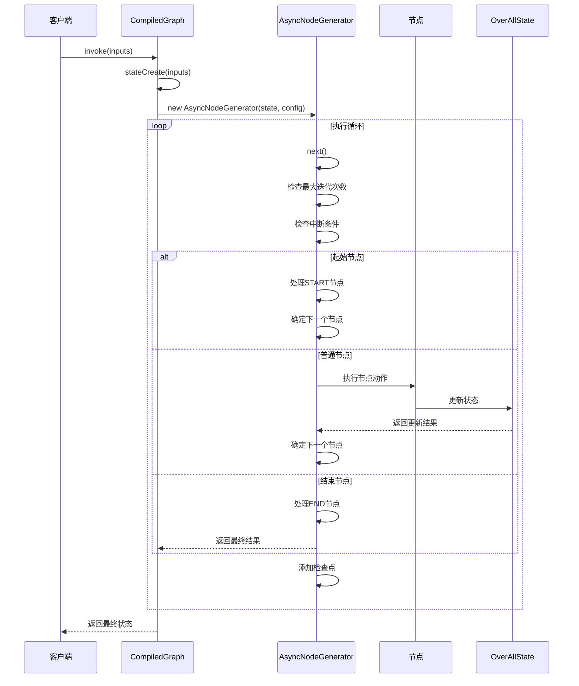
```mermaid
sequenceDiagram
    participant Client as 客户端
    participant CG as CompiledGraph
    participant ANG as AsyncNodeGenerator
    participant Node as 节点
    participant State as OverAllState
    
    Client->>CG: invoke(inputs)
    CG->>CG: stateCreate(inputs)
    CG->>ANG: new AsyncNodeGenerator(state, config)
    
    loop 执行循环
        ANG->>ANG: next()
        ANG->>ANG: 检查最大迭代次数
        ANG->>ANG: 检查中断条件
        
        alt 起始节点
            ANG->>ANG: 处理START节点
            ANG->>ANG: 确定下一个节点
        else 普通节点
            ANG->>Node: 执行节点动作
            Node->>State: 更新状态
            State-->>ANG: 返回更新结果
            ANG->>ANG: 确定下一个节点
        else 结束节点
            ANG->>ANG: 处理END节点
            ANG-->>CG: 返回最终结果
        end
        
        ANG->>ANG: 添加检查点
    end
    
    CG-->>Client: 返回最终状态
```

**核心执行机制**：CompiledGraph采用了基于迭代器模式的异步执行机制，每次调用next()方法都会推进工作流的执行，这种设计既支持同步调用，也支持流式处理，为不同的使用场景提供了灵活性。

### 2.3 核心组件关系图
**组件职责说明**：

+ **StateGraph**：工作流的架构师，负责定义整个流程的结构和规则
+ **CompiledGraph**：工作流的指挥官，负责协调和管理整个执行过程
+ **OverAllState**：工作流的记忆中心，负责存储和管理所有状态数据
+ **Node**：工作流的执行单元，每个节点专注于特定的业务逻辑
+ **Edge**：工作流的连接器，定义节点之间的转换关系和条件
+ **AsyncNodeGenerator**：工作流的执行引擎，是推动整个流程运转的核心状态机

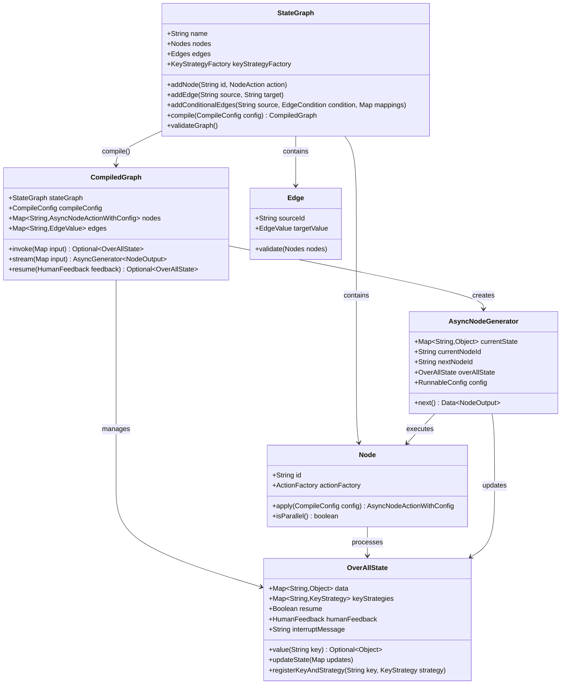
```mermaid
classDiagram
    class StateGraph {
        +String name
        +Nodes nodes
        +Edges edges
        +KeyStrategyFactory keyStrategyFactory
        +addNode(String id, NodeAction action)
        +addEdge(String source, String target)
        +addConditionalEdges(String source, EdgeCondition condition, Map mappings)
        +compile(CompileConfig config) CompiledGraph
        +validateGraph()
    }
    
    class CompiledGraph {
        +StateGraph stateGraph
        +CompileConfig compileConfig
        +Map~String,AsyncNodeActionWithConfig~ nodes
        +Map~String,EdgeValue~ edges
        +invoke(Map input) Optional~OverAllState~
        +stream(Map input) AsyncGenerator~NodeOutput~
        +resume(HumanFeedback feedback) Optional~OverAllState~
    }
    
    class OverAllState {
        +Map~String,Object~ data
        +Map~String,KeyStrategy~ keyStrategies
        +Boolean resume
        +HumanFeedback humanFeedback
        +String interruptMessage
        +value(String key) Optional~Object~
        +updateState(Map updates)
        +registerKeyAndStrategy(String key, KeyStrategy strategy)
    }
    
    class Node {
        +String id
        +ActionFactory actionFactory
        +apply(CompileConfig config) AsyncNodeActionWithConfig
        +isParallel() boolean
    }
    
    class Edge {
        +String sourceId
        +EdgeValue targetValue
        +validate(Nodes nodes)
    }
    
    class AsyncNodeGenerator {
        +Map~String,Object~ currentState
        +String currentNodeId
        +String nextNodeId
        +OverAllState overAllState
        +RunnableConfig config
        +next() Data~NodeOutput~
    }
    
    StateGraph --> CompiledGraph : compile()
    StateGraph --> Node : contains
    StateGraph --> Edge : contains
    CompiledGraph --> OverAllState : manages
    CompiledGraph --> AsyncNodeGenerator : creates
    Node --> OverAllState : processes
    AsyncNodeGenerator --> Node : executes
    AsyncNodeGenerator --> OverAllState : updates
```

### 2.4 核心设计理念
#### 2.4.1 声明式编程模型
借鉴LangGraph的设计理念，Spring AI Alibaba Graph采用声明式编程模型，开发者只需要描述"做什么"：

```java
// 声明式定义工作流
StateGraph graph = new StateGraph("客户服务工作流", stateFactory)
    .addNode("feedback_classifier", node_async(feedbackClassifier))
    .addNode("specific_question_classifier", node_async(specificQuestionClassifier))
    .addNode("recorder", node_async(recorderNode))
    .addEdge(START, "feedback_classifier")
    .addConditionalEdges("feedback_classifier", 
        edge_async(new FeedbackQuestionDispatcher()),
        Map.of("positive", "recorder", "negative", "specific_question_classifier"))
    .addEdge("recorder", END);
```

#### 2.4.2 状态驱动的执行模型
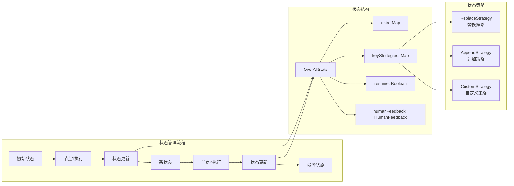
```mermaid
flowchart LR
    subgraph "状态管理流程"
        S1[初始状态] --> N1[节点1执行]
        N1 --> U1[状态更新]
        U1 --> S2[新状态]
        S2 --> N2[节点2执行]
        N2 --> U2[状态更新]
        U2 --> S3[最终状态]
    end
    
    subgraph "状态结构"
        OS[OverAllState]
        OS --> D[data: Map<String,Object>]
        OS --> KS[keyStrategies: Map<String,KeyStrategy>]
        OS --> R[resume: Boolean]
        OS --> HF[humanFeedback: HumanFeedback]
    end
    
    subgraph "状态策略"
        RS[ReplaceStrategy<br/>替换策略]
        AS[AppendStrategy<br/>追加策略]
        CS[CustomStrategy<br/>自定义策略]
    end
    
    U1 --> OS
    U2 --> OS
    KS --> RS
    KS --> AS
    KS --> CS
```

所有的数据流转都通过`OverAllState`进行管理，确保状态的一致性和可追溯性：

```java
// 状态工厂定义
KeyStrategyFactory stateFactory = () -> {
    Map<String, KeyStrategy> strategies = new HashMap<>();
    strategies.put("input", new ReplaceStrategy());
    strategies.put("classifier_output", new ReplaceStrategy());
    strategies.put("solution", new ReplaceStrategy());
    return strategies;
};
```

#### 2.4.3 异步优先的设计
框架优先支持异步处理，提高系统的吞吐量和响应性，同时还原生支持了**节点内模型流式透传**：

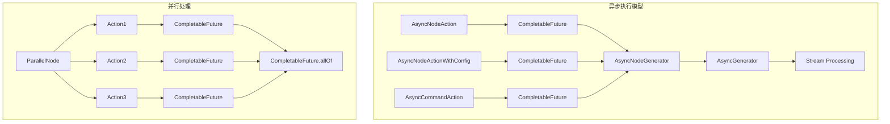
```mermaid
graph TD
    subgraph "异步执行模型"
        A1[AsyncNodeAction] --> CF1[CompletableFuture]
        A2[AsyncNodeActionWithConfig] --> CF2[CompletableFuture]
        A3[AsyncCommandAction] --> CF3[CompletableFuture]
        
        CF1 --> ANG[AsyncNodeGenerator]
        CF2 --> ANG
        CF3 --> ANG
        
        ANG --> AG[AsyncGenerator]
        AG --> Stream[Stream Processing]
    end
    
    subgraph "并行处理"
        PN[ParallelNode] --> PA1[Action1]
        PN --> PA2[Action2]
        PN --> PA3[Action3]
        
        PA1 --> CF4[CompletableFuture]
        PA2 --> CF5[CompletableFuture]
        PA3 --> CF6[CompletableFuture]
        
        CF4 --> ALLOF[CompletableFuture.allOf]
        CF5 --> ALLOF
        CF6 --> ALLOF
    end
```

```java
// 异步节点定义
AsyncNodeAction asyncNode = node_async(new CustomNodeAction());

// 并行节点处理
public class ParallelNode extends Node {
    record AsyncParallelNodeAction(
        List<AsyncNodeActionWithConfig> actions,
        Map<String, KeyStrategy> channels
    ) implements AsyncNodeActionWithConfig {
        
        @Override
        public CompletableFuture<Map<String, Object>> apply(OverAllState state, RunnableConfig config) {
            var futures = actions.stream()
                .map(action -> action.apply(state, config))
                .toArray(CompletableFuture[]::new);
            
            return CompletableFuture.allOf(futures)
                .thenApply(v -> {
                    // 合并所有结果
                    Map<String, Object> result = new HashMap<>();
                    for (CompletableFuture<Map<String, Object>> future : futures) {
                        result.putAll(future.join());
                    }
                    return result;
                });
        }
    }
}
```

### 2.5 Spring生态集成
Spring AI Alibaba Graph与Spring生态深度集成，您可以轻松在您的Spring应用中引入AI模型工作流以开发智能Java应用。

#### 2.5.1 依赖注入架构
```mermaid
graph TB
    subgraph "Spring Boot应用层"
        APP[Spring Boot Application]
        CTRL[REST Controller]
        SVC[Service Layer]
    end
    
    subgraph "Graph配置层"
        CONF[GraphConfiguration]
        BEAN1[@Bean StateGraph]
        BEAN2[@Bean CompiledGraph]
        BEAN3[@Bean ChatModel]
    end
    
    subgraph "Spring容器管理"
        IOC[IoC Container]
        DI[Dependency Injection]
        AOP[AOP Support]
    end
    
    subgraph "观测性集成"
        OBS[ObservationRegistry]
        METRICS[Metrics Collection]
        TRACING[Distributed Tracing]
    end
    
    APP --> CTRL
    CTRL --> SVC
    SVC --> BEAN2
    CONF --> BEAN1
    CONF --> BEAN2
    CONF --> BEAN3
    
    IOC --> DI
    DI --> CONF
    AOP --> OBS
    OBS --> METRICS
    OBS --> TRACING
```

#### 2.5.2 依赖注入支持
以下代码演示了Spring AI Alibaba Graph是如何被IOC容器所管理的。

```java
@Configuration
public class GraphConfiguration {
    
    @Bean
    public StateGraph workflowGraph(ChatModel chatModel) {
        ChatClient chatClient = ChatClient.builder(chatModel)
            .defaultAdvisors(new SimpleLoggerAdvisor())
            .build();
        
        // 构建图定义...
        return stateGraph;
    }
    
    @Bean
    public CompiledGraph compiledGraph(StateGraph stateGraph, 
                                      ObservationRegistry observationRegistry) {
        return stateGraph.compile(CompileConfig.builder()
            .withLifecycleListener(new GraphObservationLifecycleListener(observationRegistry))
            .build());
    }
}
```

#### 2.5.3 观测性集成
Spring AI Alibaba Graph基于Micrometer内置了可观测支持，可以无缝集成Spring Boot可观测性。

```java
@RestController
public class GraphController {
    
    public GraphController(@Qualifier("workflowGraph") StateGraph stateGraph,
                          ObjectProvider<ObservationRegistry> observationRegistry) {
        this.compiledGraph = stateGraph.compile(CompileConfig.builder()
            .withLifecycleListener(new GraphObservationLifecycleListener(
                observationRegistry.getIfUnique(() -> ObservationRegistry.NOOP)))
            .build());
    }
}
```


## 3. 核心概念深度解析
### 3.1 StateGraph (状态图)
**StateGraph是整个框架的设计蓝图**，它就像建筑师的设计图纸一样，定义了工作流的完整结构和执行逻辑。StateGraph采用声明式API，让开发者可以用简洁的代码描述复杂的业务流程，而不需要关心底层的执行细节。

**核心设计理念**：StateGraph将复杂的工作流抽象为节点和边的组合，每个节点代表一个具体的操作，边定义了操作之间的流转关系。这种抽象让开发者可以专注于业务逻辑的设计，而不是执行机制的实现。

#### 3.1.1 StateGraph生命周期
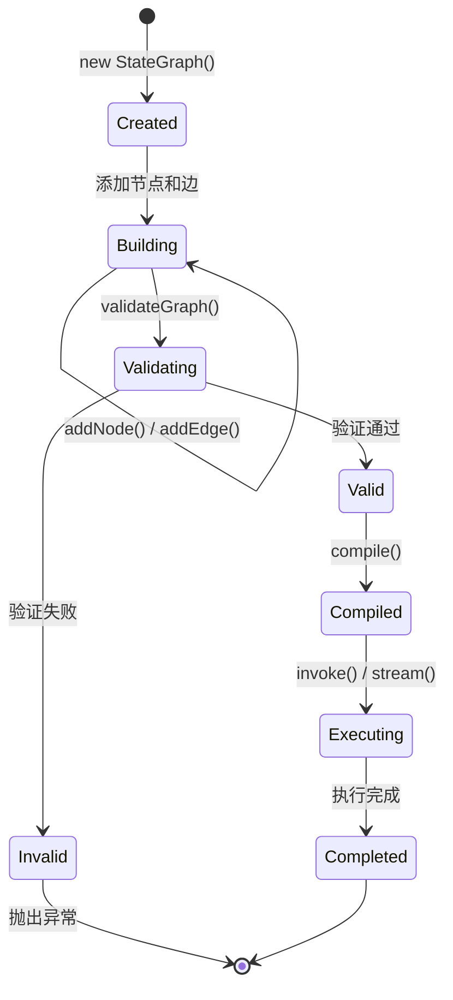
```mermaid
stateDiagram-v2
    [*] --> Created: new StateGraph()
    Created --> Building: 添加节点和边
    Building --> Building: addNode() / addEdge()
    Building --> Validating: validateGraph()
    Validating --> Invalid: 验证失败
    Invalid --> [*]: 抛出异常
    Validating --> Valid: 验证通过
    Valid --> Compiled: compile()
    Compiled --> Executing: invoke() / stream()
    Executing --> Completed: 执行完成
    Completed --> [*]
```

#### 3.1.2 基本构造
```java
public class StateGraph {
    // 核心数据结构
    final Nodes nodes = new Nodes();  // 存储所有节点
    final Edges edges = new Edges();  // 存储所有边
    
    // 特殊节点常量
    public static final String END = "__END__";
    public static final String START = "__START__";
    public static final String ERROR = "__ERROR__";
    
    // 状态管理
    private KeyStrategyFactory keyStrategyFactory;
    private PlainTextStateSerializer stateSerializer;
}
```

#### 3.1.3 节点管理流程
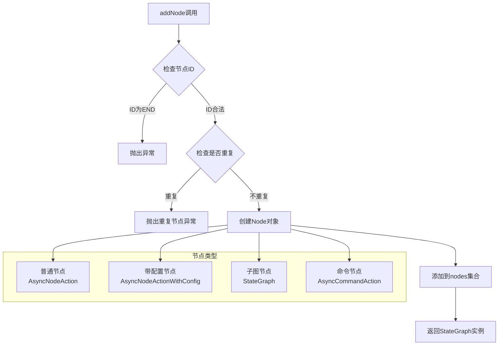
```mermaid
flowchart TD
    A[addNode调用] --> B{检查节点ID}
    B -->|ID为END| C[抛出异常]
    B -->|ID合法| D{检查是否重复}
    D -->|重复| E[抛出重复节点异常]
    D -->|不重复| F[创建Node对象]
    F --> G[添加到nodes集合]
    G --> H[返回StateGraph实例]
    
    subgraph "节点类型"
        I[普通节点<br/>AsyncNodeAction]
        J[带配置节点<br/>AsyncNodeActionWithConfig]
        K[子图节点<br/>StateGraph]
        L[命令节点<br/>AsyncCommandAction]
    end
    
    F --> I
    F --> J
    F --> K
    F --> L
```

支持的节点添加方式：

```java
// 添加普通节点
public StateGraph addNode(String id, AsyncNodeAction action) {
    Node node = new Node(id, (config) -> AsyncNodeActionWithConfig.of(action));
    return addNode(id, node);
}

// 添加带配置的节点
public StateGraph addNode(String id, AsyncNodeActionWithConfig actionWithConfig) {
    Node node = new Node(id, (config) -> actionWithConfig);
    return addNode(id, node);
}

// 添加子图节点
public StateGraph addNode(String id, StateGraph subGraph) {
    subGraph.validateGraph(); // 先验证子图
    var node = new SubStateGraphNode(id, subGraph);
    return addNode(id, node);
}
```

#### 3.1.4 边管理流程
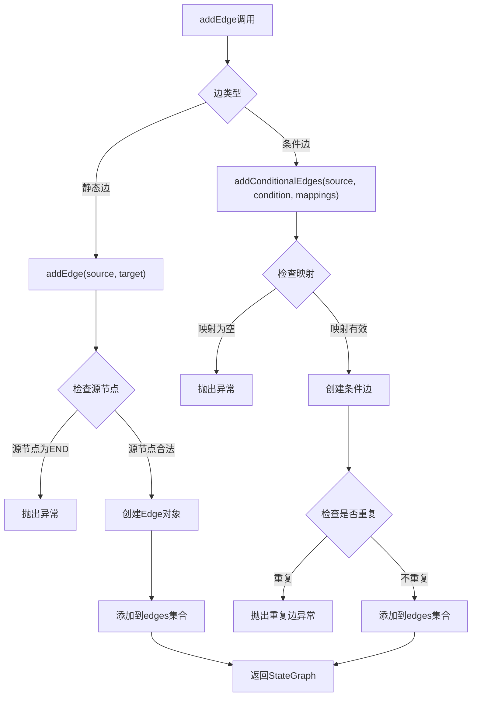
```mermaid
flowchart TD
    A["addEdge调用"] --> B{"边类型"}
    B -->|静态边| C["addEdge(source, target)"]
    B -->|条件边| D["addConditionalEdges(source, condition, mappings)"]
    
    C --> E{"检查源节点"}
    E -->|源节点为END| F["抛出异常"]
    E -->|源节点合法| G["创建Edge对象"]
    G --> H["添加到edges集合"]
    
    D --> I{"检查映射"}
    I -->|映射为空| J["抛出异常"]
    I -->|映射有效| K["创建条件边"]
    K --> L{"检查是否重复"}
    L -->|重复| M["抛出重复边异常"]
    L -->|不重复| N["添加到edges集合"]
    
    H --> O["返回StateGraph"]
    N --> O
```

#### 3.1.5 图验证机制
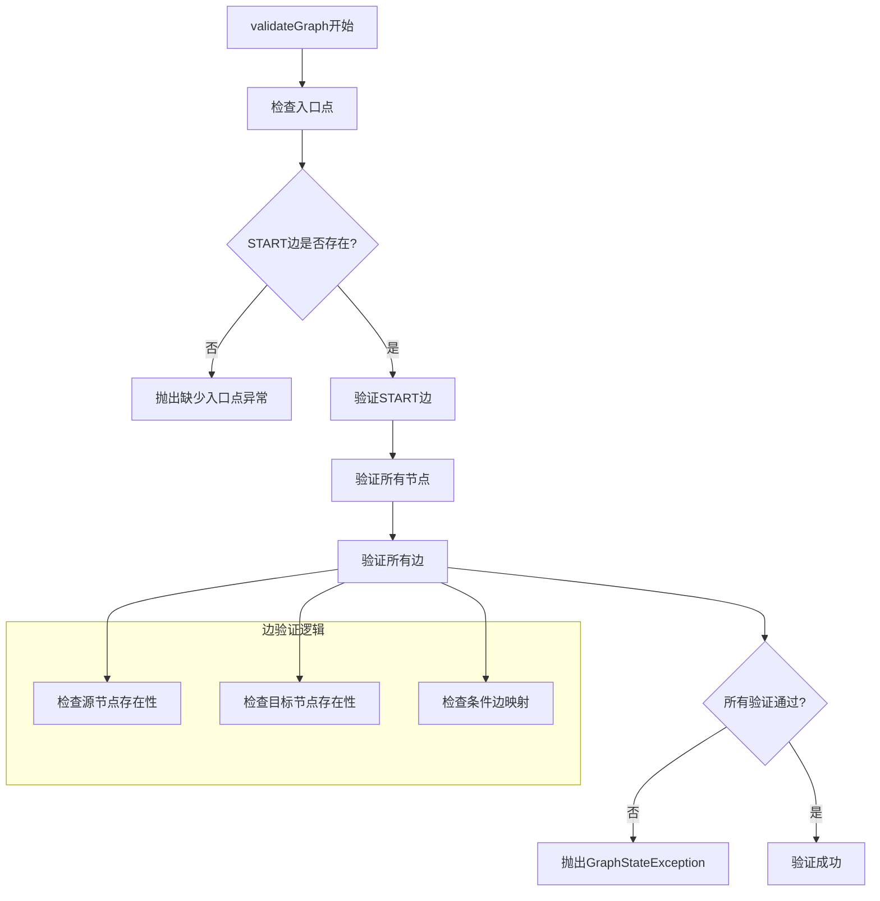
```mermaid
flowchart TD
    A[validateGraph开始] --> B[检查入口点]
    B --> C{START边是否存在?}
    C -->|否| D[抛出缺少入口点异常]
    C -->|是| E[验证START边]
    E --> F[验证所有节点]
    F --> G[验证所有边]
    G --> H{所有验证通过?}
    H -->|否| I[抛出GraphStateException]
    H -->|是| J[验证成功]
    
    subgraph "边验证逻辑"
        K[检查源节点存在性]
        L[检查目标节点存在性]
        M[检查条件边映射]
    end
    
    G --> K
    G --> L
    G --> M
```

### 3.2 OverAllState (全局状态)
**OverAllState是工作流的数据中枢**，它就像工作流的记忆系统一样，负责在各个节点之间传递和管理状态数据。OverAllState不仅存储数据，还定义了数据的合并策略，确保不同节点产生的数据能够正确地整合在一起。

**设计巧思**：OverAllState采用了策略模式来处理状态更新，不同的数据类型可以采用不同的合并策略（如替换、追加、合并等），这种设计让状态管理变得非常灵活，能够适应各种复杂的业务场景。

#### 3.2.1 状态管理架构
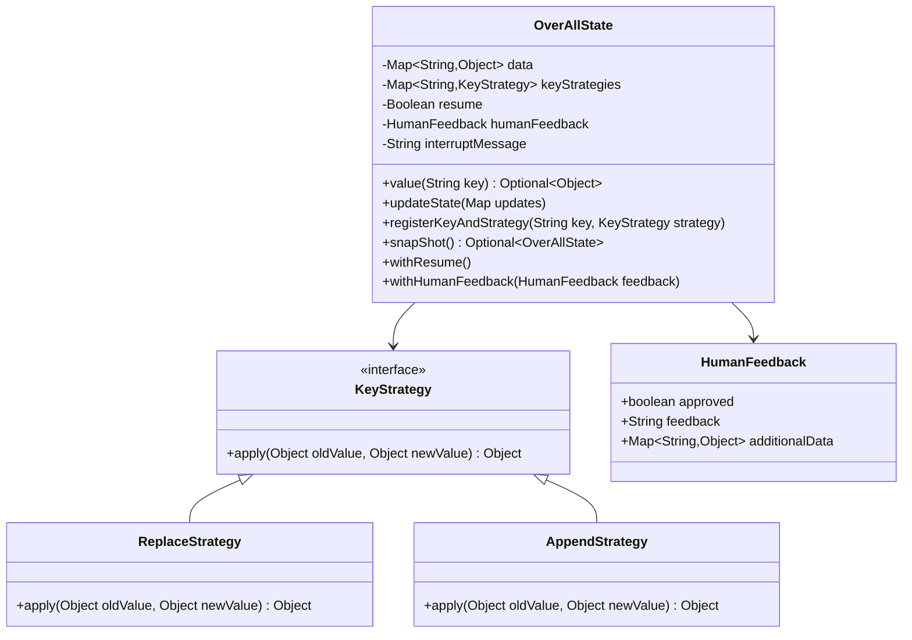
```mermaid
classDiagram
    class OverAllState {
        -Map~String,Object~ data
        -Map~String,KeyStrategy~ keyStrategies
        -Boolean resume
        -HumanFeedback humanFeedback
        -String interruptMessage
        +value(String key) Optional~Object~
        +updateState(Map updates)
        +registerKeyAndStrategy(String key, KeyStrategy strategy)
        +snapShot() Optional~OverAllState~
        +withResume()
        +withHumanFeedback(HumanFeedback feedback)
    }
    
    class KeyStrategy {
        <<interface>>
        +apply(Object oldValue, Object newValue) Object
    }
    
    class ReplaceStrategy {
        +apply(Object oldValue, Object newValue) Object
    }
    
    class AppendStrategy {
        +apply(Object oldValue, Object newValue) Object
    }
    
    class HumanFeedback {
        +boolean approved
        +String feedback
        +Map~String,Object~ additionalData
    }
    
    OverAllState --> KeyStrategy
    OverAllState --> HumanFeedback
    KeyStrategy <|-- ReplaceStrategy
    KeyStrategy <|-- AppendStrategy
```

#### 3.2.2 状态更新流程
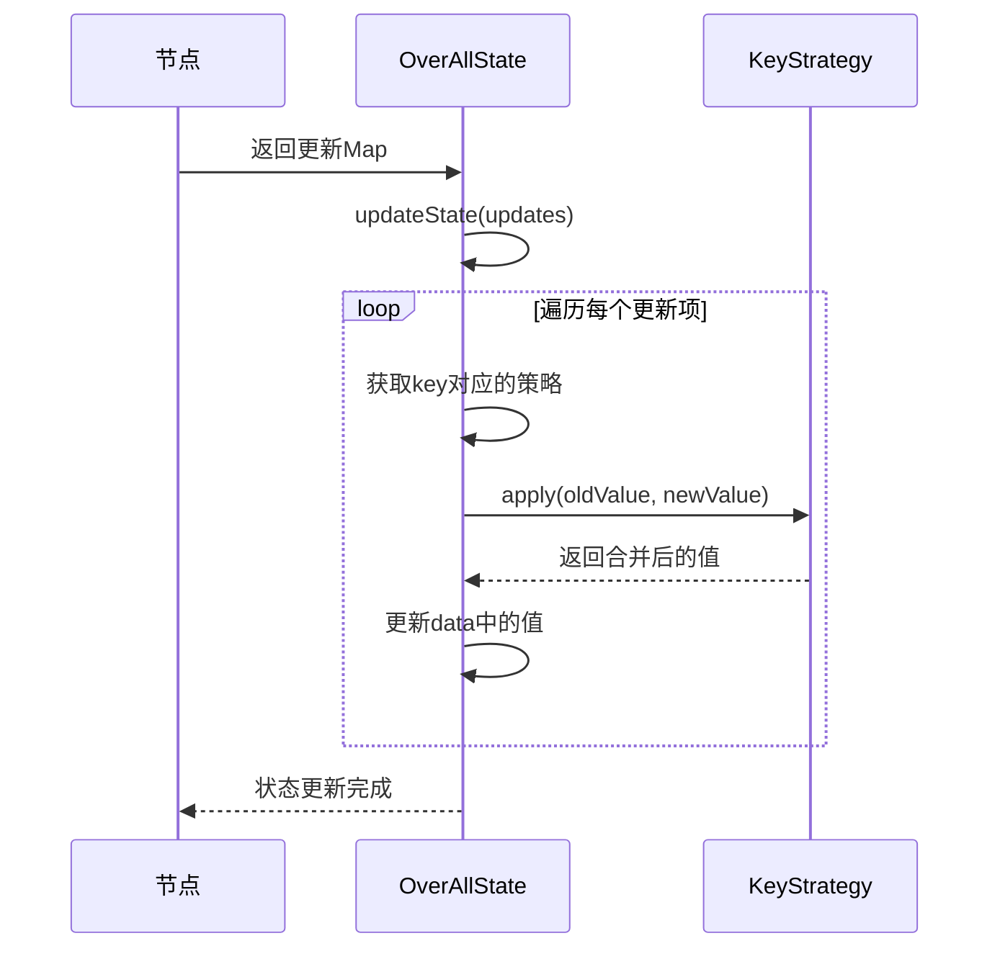
```mermaid
sequenceDiagram
    participant Node as 节点
    participant State as OverAllState
    participant Strategy as KeyStrategy
    
    Node->>State: 返回更新Map
    State->>State: updateState(updates)
    
    loop 遍历每个更新项
        State->>State: 获取key对应的策略
        State->>Strategy: apply(oldValue, newValue)
        Strategy-->>State: 返回合并后的值
        State->>State: 更新data中的值
    end
    
    State-->>Node: 状态更新完成
```

#### 3.2.3 状态策略详解
**策略模式架构**：

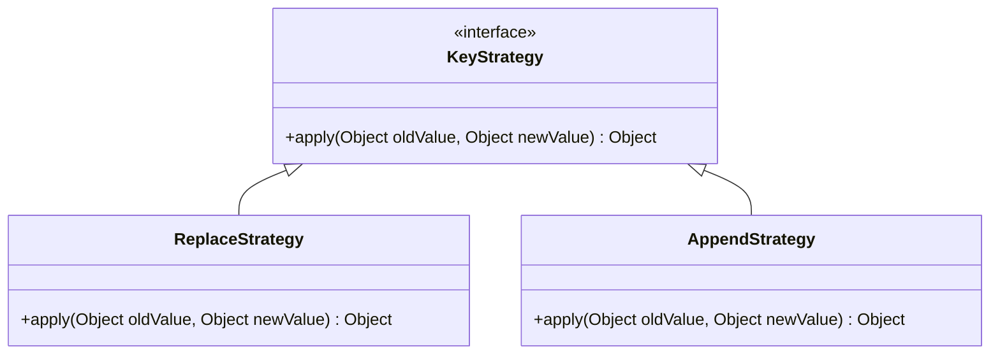
```mermaid
classDiagram
    class KeyStrategy {
        <<interface>>
        +apply(Object oldValue, Object newValue) Object
    }
    
    class ReplaceStrategy {
        +apply(Object oldValue, Object newValue) Object
    }
    
    class AppendStrategy {
        +apply(Object oldValue, Object newValue) Object
    }
    
    KeyStrategy <|-- ReplaceStrategy
    KeyStrategy <|-- AppendStrategy
```

**内置策略实现**：

```java
// 替换策略 - 新值覆盖旧值
public class ReplaceStrategy implements KeyStrategy {
    @Override
    public Object apply(Object oldValue, Object newValue) {
        return newValue;
    }
}

// 追加策略 - 新值追加到列表，支持复杂的列表操作
public class AppendStrategy implements KeyStrategy {
    @Override
    public Object apply(Object oldValue, Object newValue) {
        if (newValue == null) {
            return oldValue;
        }
        
        // 处理Optional类型
        if (oldValue instanceof Optional<?> oldValueOptional) {
            oldValue = oldValueOptional.orElse(null);
        }
        
        boolean oldValueIsList = oldValue instanceof List<?>;
        
        // 处理移除操作
        if (oldValueIsList && newValue instanceof AppenderChannel.RemoveIdentifier<?>) {
            var result = new ArrayList<>((List<Object>) oldValue);
            removeFromList(result, (AppenderChannel.RemoveIdentifier) newValue);
            return unmodifiableList(result);
        }
        
        // 处理新值为集合的情况
        List<Object> list = null;
        if (newValue instanceof List) {
            list = new ArrayList<>((List<?>) newValue);
        } else if (newValue.getClass().isArray()) {
            list = Arrays.asList((Object[]) newValue);
        } else if (newValue instanceof Collection) {
            list = new ArrayList<>((Collection<?>) newValue);
        }
        
        // 合并逻辑
        if (oldValueIsList) {
            List<Object> oldList = (List<Object>) oldValue;
            if (list != null) {
                if (list.isEmpty()) {
                    return oldValue;
                }
                // 合并并去重
                var result = evaluateRemoval(oldList, list);
                return Stream.concat(result.oldValues().stream(), result.newValues().stream())
                    .distinct()
                    .collect(Collectors.toList());
            } else {
                oldList.add(newValue);
            }
            return oldList;
        } else {
            ArrayList<Object> arrayResult = new ArrayList<>();
            if (list != null) {
                arrayResult.addAll(list);
            } else {
                arrayResult.add(newValue);
            }
            return arrayResult;
        }
    }
}
```

**自定义策略示例**：

```java
// 自定义Map合并策略
public class MapMergeStrategy implements KeyStrategy {
    @Override
    public Object apply(Object oldValue, Object newValue) {
        if (oldValue instanceof Map && newValue instanceof Map) {
            Map<String, Object> merged = new HashMap<>((Map) oldValue);
            merged.putAll((Map) newValue);
            return merged;
        }
        return newValue; // 默认替换
    }
}

// 自定义字符串连接策略
public class StringConcatStrategy implements KeyStrategy {
    private final String separator;
    
    public StringConcatStrategy(String separator) {
        this.separator = separator;
    }
    
    @Override
    public Object apply(Object oldValue, Object newValue) {
        if (oldValue instanceof String && newValue instanceof String) {
            return oldValue + separator + newValue;
        }
        return newValue;
    }
}
```

**策略工厂模式**：

```java
public class StrategyFactory {
    
    public static KeyStrategyFactory createDefaultFactory() {
        return () -> {
            Map<String, KeyStrategy> strategies = new HashMap<>();
            strategies.put("messages", new AppendStrategy());
            strategies.put("input", new ReplaceStrategy());
            strategies.put("output", new ReplaceStrategy());
            return strategies;
        };
    }
    
    public static KeyStrategyFactory createCustomFactory(Map<String, KeyStrategy> customStrategies) {
        return () -> {
            Map<String, KeyStrategy> strategies = new HashMap<>();
            // 添加默认策略
            strategies.put("messages", new AppendStrategy());
            strategies.put("input", new ReplaceStrategy());
            // 覆盖自定义策略
            strategies.putAll(customStrategies);
            return strategies;
        };
    }
}
```

### 3.3 Node (节点)
**Node是工作流的功能模块**，每个节点就像一个专门的工作站，负责执行特定的业务逻辑。Node的设计遵循单一职责原则，每个节点只关注一件事情，这样既保证了代码的可维护性，也提高了节点的可复用性。

**执行特性**：Node支持同步和异步两种执行模式，还支持并行执行多个子任务。这种灵活的执行机制让Node既能处理简单的数据转换，也能处理复杂的外部服务调用，满足各种性能要求。

#### 3.3.1 节点执行流程
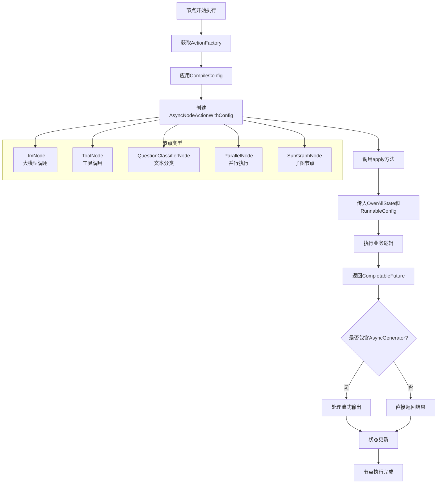
```mermaid
flowchart TD
    A[节点开始执行] --> B[获取ActionFactory]
    B --> C[应用CompileConfig]
    C --> D[创建AsyncNodeActionWithConfig]
    D --> E[调用apply方法]
    E --> F[传入OverAllState和RunnableConfig]
    F --> G[执行业务逻辑]
    G --> H[返回CompletableFuture]
    H --> I{是否包含AsyncGenerator?}
    I -->|是| J[处理流式输出]
    I -->|否| K[直接返回结果]
    J --> L[状态更新]
    K --> L
    L --> M[节点执行完成]
    
    subgraph "节点类型"
        N1[LlmNode<br/>大模型调用]
        N2[ToolNode<br/>工具调用]
        N3[QuestionClassifierNode<br/>文本分类]
        N4[ParallelNode<br/>并行执行]
        N5[SubGraphNode<br/>子图节点]
    end
    
    D --> N1
    D --> N2
    D --> N3
    D --> N4
    D --> N5
```

#### 3.3.2 节点类型层次结构
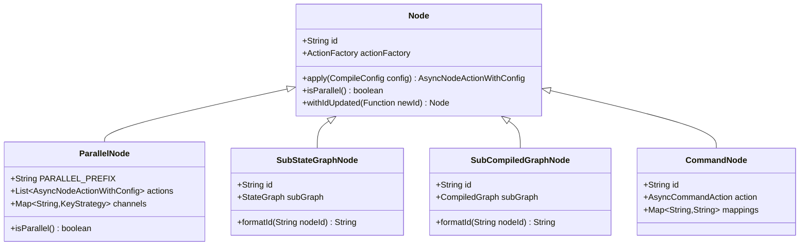
```mermaid
classDiagram
    class Node {
        +String id
        +ActionFactory actionFactory
        +apply(CompileConfig config) AsyncNodeActionWithConfig
        +isParallel() boolean
        +withIdUpdated(Function newId) Node
    }
    
    class ParallelNode {
        +String PARALLEL_PREFIX
        +List~AsyncNodeActionWithConfig~ actions
        +Map~String,KeyStrategy~ channels
        +isParallel() boolean
    }
    
    class SubStateGraphNode {
        +String id
        +StateGraph subGraph
        +formatId(String nodeId) String
    }
    
    class SubCompiledGraphNode {
        +String id
        +CompiledGraph subGraph
        +formatId(String nodeId) String
    }
    
    class CommandNode {
        +String id
        +AsyncCommandAction action
        +Map~String,String~ mappings
    }
    
    Node <|-- ParallelNode
    Node <|-- SubStateGraphNode
    Node <|-- SubCompiledGraphNode
    Node <|-- CommandNode
```

#### 3.3.3 并行节点处理机制
```mermaid
sequenceDiagram
    participant PNode as ParallelNode
    participant Action1 as Action1
    participant Action2 as Action2
    participant Action3 as Action3
    participant CF as CompletableFuture
    
    PNode->>Action1: apply(state, config)
    PNode->>Action2: apply(state, config)
    PNode->>Action3: apply(state, config)
    
    Action1-->>CF: CompletableFuture1
    Action2-->>CF: CompletableFuture2
    Action3-->>CF: CompletableFuture3
    
    CF->>CF: CompletableFuture.allOf()
    CF->>PNode: 所有任务完成
    
    PNode->>PNode: 合并结果
    PNode-->>PNode: 返回合并后的状态
```

### 3.4 Edge (边)
**Edge是工作流的路由器**，它决定了数据在节点之间的流转路径。Edge不仅仅是简单的连接线，它还包含了复杂的条件判断逻辑，能够根据当前状态动态决定下一步的执行路径。

**智能路由**：Edge支持静态路由和动态路由两种模式。静态边提供固定的转换路径，而条件边则可以根据状态内容进行智能判断，这种设计让工作流具备了强大的条件分支能力，能够处理各种复杂的业务逻辑。

#### 3.4.1 边的类型与结构
```mermaid
classDiagram
    class Edge {
        +String sourceId
        +EdgeValue targetValue
        +validate(Nodes nodes)
        +List~EdgeValue~ targets()
    }
    
    class EdgeValue {
        <<sealed interface>>
        +String id()
        +EdgeCondition value()
    }
    
    class EdgeValue_Const {
        +String value
    }
    
    class EdgeValue_Condition {
        +EdgeCondition condition
        +Map~String,String~ mappings
    }
    
    class EdgeCondition {
        +AsyncCommandAction action
        +Map~String,String~ mappings
        +apply(OverAllState state, RunnableConfig config) CompletableFuture~Command~
    }
    
    Edge --> EdgeValue
    EdgeValue <|-- EdgeValue_Const
    EdgeValue <|-- EdgeValue_Condition
    EdgeValue_Condition --> EdgeCondition
```

#### 3.4.2 条件边路由流程
```mermaid
flowchart TD
    A[到达条件边] --> B[获取EdgeCondition]
    B --> C[执行condition.apply]
    C --> D[获取Command结果]
    D --> E[提取gotoNode值]
    E --> F[在mappings中查找]
    F --> G{找到映射?}
    G -->|是| H[返回目标节点ID]
    G -->|否| I[抛出映射缺失异常]
    H --> J[跳转到目标节点]
    
    subgraph "条件评估示例"
        K[FeedbackQuestionDispatcher]
        K --> L[分析classifier_output]
        L --> M{包含positive?}
        M -->|是| N[返回positive]
        M -->|否| O[返回negative]
    end
    
    C --> K
```

#### 3.4.3 边验证机制
```java
public class Edge {
    public void validate(Nodes nodes) throws GraphStateException {
        // 验证源节点存在
        if (!nodes.anyMatchById(sourceId)) {
            throw Errors.missingNodeInEdgeMapping.exception(sourceId);
        }
        
        // 验证目标节点
        for (EdgeValue target : targets()) {
            if (target.id() != null) {
                // 静态边：直接验证目标节点
                if (!nodes.anyMatchById(target.id()) && !END.equals(target.id())) {
                    throw Errors.missingNodeInEdgeMapping.exception(target.id());
                }
            } else if (target.value() != null) {
                // 条件边：验证映射中的所有目标节点
                for (String targetNodeId : target.value().mappings().values()) {
                    if (!nodes.anyMatchById(targetNodeId) && !END.equals(targetNodeId)) {
                        throw Errors.missingNodeInEdgeMapping.exception(targetNodeId);
                    }
                }
            }
        }
    }
}
```

### 3.5 CompiledGraph (编译图)
**CompiledGraph是工作流的执行引擎**，它将StateGraph的静态定义转换为高效的运行时代码。就像将高级语言编译成机器码一样，CompiledGraph对工作流进行了各种优化，包括节点预处理、边路由优化、状态管理策略等。

**运行时优化**：CompiledGraph在编译过程中会进行多种优化，如节点依赖分析、并行执行规划、状态访问优化等，这些优化确保了工作流在运行时的高效性和稳定性。

#### 3.5.1 编译过程详解
```mermaid
flowchart TD
    A[StateGraph.compile] --> B[创建CompiledGraph]
    B --> C[处理节点和边]
    C --> D[检查中断配置]
    D --> E[创建节点映射]
    E --> F[创建边映射]
    F --> G[处理子图节点]
    G --> H[生成最终CompiledGraph]
    
    subgraph "ProcessedNodesEdgesAndConfig"
        I[处理普通节点]
        J[处理子图节点]
        K[处理并行节点]
        L[处理中断配置]
    end
    
    C --> I
    C --> J
    C --> K
    C --> L
```

#### 3.5.2 AsyncNodeGenerator执行机制
**AsyncNodeGenerator是工作流执行的核心状态机**，它负责推动整个工作流的运行。AsyncNodeGenerator采用了基于迭代器的设计模式，每次调用next()方法都会执行一个步骤，这种设计既支持同步执行，也支持异步流式处理。

**执行控制**：AsyncNodeGenerator内置了完善的执行控制机制，包括最大迭代次数检查、中断条件处理、错误恢复等，确保工作流在各种情况下都能稳定运行。

```mermaid
stateDiagram-v2
    [*] --> Initializing: 创建AsyncNodeGenerator
    Initializing --> CheckingResume: 检查是否恢复模式
    CheckingResume --> Resuming: 恢复模式
    CheckingResume --> Starting: 正常启动
    
    Resuming --> LoadingCheckpoint: 加载检查点
    LoadingCheckpoint --> RestoringState: 恢复状态
    RestoringState --> Ready: 准备执行
    
    Starting --> InitializingState: 初始化状态
    InitializingState --> Ready: 准备执行
    
    Ready --> Executing: 开始执行
    Executing --> CheckingIteration: 检查迭代次数
    CheckingIteration --> MaxIterationReached: 达到最大迭代
    CheckingIteration --> CheckingInterrupt: 检查中断
    CheckingInterrupt --> Interrupted: 中断执行
    CheckingInterrupt --> ExecutingNode: 执行节点
    
    ExecutingNode --> UpdatingState: 更新状态
    UpdatingState --> SavingCheckpoint: 保存检查点
    SavingCheckpoint --> DeterminingNext: 确定下一节点
    DeterminingNext --> CheckingEnd: 检查是否结束
    CheckingEnd --> Completed: 执行完成
    CheckingEnd --> Executing: 继续执行
    
    MaxIterationReached --> [*]
    Interrupted --> [*]
    Completed --> [*]
```

#### 3.5.3 状态流转核心逻辑
```java
public class AsyncNodeGenerator<Output extends NodeOutput> implements AsyncGenerator<Output> {
    
    @Override
    public Data<Output> next() {
        try {
            // 1. 检查最大迭代次数
            if (++iteration > maxIterations) {
                return Data.error(new IllegalStateException(
                    format("Maximum number of iterations (%d) reached!", maxIterations)));
            }
            
            // 2. 检查是否结束
            if (nextNodeId == null && currentNodeId == null) {
                return releaseThread().map(Data::<Output>done)
                    .orElseGet(() -> Data.done(currentState));
            }
            
            // 3. 处理START节点
            if (START.equals(currentNodeId)) {
                doListeners(START, null);
                var nextNodeCommand = getEntryPoint(currentState, config);
                nextNodeId = nextNodeCommand.gotoNode();
                currentState = nextNodeCommand.update();
                
                var cp = addCheckpoint(config, START, currentState, nextNodeId);
                var output = (cp.isPresent() && config.streamMode() == StreamMode.SNAPSHOTS)
                    ? buildStateSnapshot(cp.get()) : buildNodeOutput(currentNodeId);
                
                currentNodeId = nextNodeId;
                return Data.of(output);
            }
            
            // 4. 处理END节点
            if (END.equals(nextNodeId)) {
                nextNodeId = null;
                currentNodeId = null;
                doListeners(END, null);
                return Data.of(buildNodeOutput(END));
            }
            
            // 5. 检查中断条件
            if (shouldInterruptAfter(currentNodeId, nextNodeId)) {
                return Data.done(currentNodeId);
            }
            if (shouldInterruptBefore(nextNodeId, currentNodeId)) {
                return Data.done(currentNodeId);
            }
            
            // 6. 执行节点
            currentNodeId = nextNodeId;
            var action = nodes.get(currentNodeId);
            return Data.of(evaluateAction(action, overAllState));
            
        } catch (Exception e) {
            return Data.error(e);
        }
    }
}
```


## 4. 预定义组件与工具箱
### 4.1 预定义节点类型
**Spring AI Alibaba Graph提供了丰富的预定义节点工具箱**，这些节点就像乐高积木一样，开发者可以通过组合这些预定义节点快速构建复杂的AI应用。每个预定义节点都经过了精心设计和优化，不仅功能强大，而且易于使用。

**设计理念**：预定义节点的设计遵循了"开箱即用"的原则，开发者只需要提供必要的配置参数，就能立即使用这些节点的强大功能，大大降低了AI应用的开发门槛。

#### 4.1.1 节点分类架构
```mermaid
graph TB
    subgraph "预定义节点体系"
        A[NodeAction接口]
        A --> B[LlmNode<br/>大模型节点]
        A --> C[ToolNode<br/>工具节点]
        A --> D[QuestionClassifierNode<br/>分类节点]
        A --> E[KnowledgeRetrievalNode<br/>检索节点]
        A --> F[ParameterParsingNode<br/>参数解析节点]
        A --> G[McpNode<br/>MCP协议节点]
        A --> H[AnswerNode<br/>答案生成节点]
        A --> I[ListOperatorNode<br/>列表操作节点]
        A --> J[CodeExecutorNode<br/>代码执行节点]
    end
    
    subgraph "节点特性"
        K[Builder模式构建]
        L[状态驱动]
        M[异步支持]
        N[流式处理]
        O[错误处理]
    end
    
    B --> K
    C --> L
    D --> M
    E --> N
    F --> O
```

#### 4.1.2 QuestionClassifierNode - 智能分类节点
**QuestionClassifierNode是工作流的智能分拣员**，它能够理解文本内容并将其归类到预定义的类别中。这个节点内置了少样本学习机制，即使没有大量训练数据，也能实现准确的分类效果。

**核心优势**：QuestionClassifierNode采用了提示工程的最佳实践，通过精心设计的提示词模板和少样本示例，让大语言模型能够准确理解分类任务的要求，实现高质量的文本分类。

```mermaid
flowchart TD
    A[QuestionClassifierNode执行] --> B[从状态获取输入文本]
    B --> C[构建分类提示词]
    C --> D[添加少样本示例]
    D --> E[调用ChatClient]
    E --> F[解析分类结果]
    F --> G[更新状态]
    G --> H[返回分类结果]
    
    subgraph "提示词构建"
        I[系统提示词模板]
        J[分类类别列表]
        K[分类指令]
        L[少样本示例]
    end
    
    C --> I
    C --> J
    C --> K
    C --> L
    
    subgraph "输出格式"
        M[JSON格式]
        M --> N[keywords: 关键词列表]
        M --> O[category_name: 分类名称]
    end
    
    F --> M
```

**应用场景**：QuestionClassifierNode特别适合客服系统的问题分类、内容审核的类型判断、邮件的自动分拣等场景，能够显著提高业务处理的自动化程度。

```java
QuestionClassifierNode classifier = QuestionClassifierNode.builder()
    .chatClient(chatClient)
    .inputTextKey("input")
    .outputKey("classifier_output")
    .categories(List.of("positive feedback", "negative feedback"))
    .classificationInstructions(List.of(
        "Try to understand the user's feeling when giving feedback."
    ))
    .build();
```

**核心实现原理：**

```java
@Override
public Map<String, Object> apply(OverAllState state) throws Exception {
    // 1. 从状态获取输入文本
    if (StringUtils.hasLength(inputTextKey)) {
        this.inputText = (String) state.value(inputTextKey).orElse(this.inputText);
    }
    
    // 2. 构建少样本学习消息
    List<Message> messages = new ArrayList<>();
    messages.add(new UserMessage(QUESTION_CLASSIFIER_USER_PROMPT_1));
    messages.add(new AssistantMessage(QUESTION_CLASSIFIER_ASSISTANT_PROMPT_1));
    messages.add(new UserMessage(QUESTION_CLASSIFIER_USER_PROMPT_2));
    messages.add(new AssistantMessage(QUESTION_CLASSIFIER_ASSISTANT_PROMPT_2));
    
    // 3. 调用大模型进行分类
    ChatResponse response = chatClient.prompt()
        .system(systemPromptTemplate.render(Map.of(
            "inputText", inputText, 
            "categories", categories,
            "classificationInstructions", classificationInstructions)))
        .user(inputText)
        .messages(messages)
        .call()
        .chatResponse();
    
    // 4. 返回分类结果
    Map<String, Object> updatedState = new HashMap<>();
    updatedState.put(outputKey, response.getResult().getOutput().getText());
    return updatedState;
}
```

#### 4.1.3 LlmNode - 大模型调用节点
**LlmNode是工作流的智能大脑**，它封装了与大语言模型的所有交互逻辑，让开发者可以轻松地在工作流中使用AI的强大能力。LlmNode不仅支持简单的文本生成，还支持复杂的对话管理和流式输出。

**智能特性**：LlmNode内置了提示词模板引擎，支持动态参数替换，还能管理完整的对话历史，这些特性让它能够处理各种复杂的AI交互场景。

```mermaid
flowchart TD
    A[LlmNode执行] --> B[初始化节点状态]
    B --> C{是否流式模式?}
    C -->|是| D[创建流式响应]
    C -->|否| E[创建同步响应]
    
    D --> F[构建StreamingChatGenerator]
    F --> G[返回AsyncGenerator]
    
    E --> H[调用ChatClient]
    H --> I[获取响应结果]
    I --> J[更新消息状态]
    
    G --> K[流式输出处理]
    J --> L[同步结果返回]
    
    subgraph "状态初始化"
        M[userPromptKey → userPrompt]
        N[systemPromptKey → systemPrompt]
        O[paramsKey → params]
        P[messagesKey → messages]
    end
    
    B --> M
    B --> N
    B --> O
    B --> P
    
    subgraph "模板渲染"
        Q[PromptTemplate.render]
        Q --> R[参数替换]
    end
    
    M --> Q
```

**流式处理优势**：LlmNode原生支持流式输出，这意味着用户可以实时看到AI的生成过程，而不需要等待完整的响应，大大提升了用户体验。

```java
LlmNode llmNode = LlmNode.builder()
    .chatClient(chatClient)
    .systemPromptTemplate("You are a helpful assistant.")
    .userPromptTemplate("Please process: {input}")
    .messagesKey("messages")
    .outputKey("llm_response")
    .stream(true)  // 启用流式输出
    .build();
```

**核心特性：**

+ **模板支持**：支持系统提示词和用户提示词模板
+ **消息历史**：支持消息历史管理
+ **流式输出**：原生支持流式处理
+ **参数渲染**：支持动态参数替换

#### 4.1.4 ToolNode - 工具调用节点
**ToolNode是工作流的万能工具箱**，它让AI能够调用外部工具和API，极大地扩展了AI的能力边界。ToolNode不仅能执行单个工具调用，还能并行执行多个工具，显著提高了处理效率。

**核心价值**：ToolNode将AI从纯文本生成扩展到了实际的行动能力，让AI能够查询数据库、调用API、执行计算等，真正实现了AI Agent的概念。

```mermaid
sequenceDiagram
    participant TN as ToolNode
    participant State as OverAllState
    participant AM as AssistantMessage
    participant TC as ToolCallback
    participant TR as ToolResponse
    
    TN->>State: 获取llm_response或messages
    State-->>TN: 返回AssistantMessage
    TN->>AM: 检查是否有工具调用
    AM-->>TN: 返回ToolCall列表
    
    loop 遍历每个ToolCall
        TN->>TC: 执行工具调用
        TC-->>TN: 返回工具结果
    end
    
    TN->>TR: 构建ToolResponseMessage
    TR-->>State: 更新messages状态
```

**灵活性设计**：ToolNode支持各种类型的工具调用，从简单的函数调用到复杂的API集成，都能轻松处理，这种灵活性让AI应用能够适应各种业务场景。

```java
ToolNode toolNode = ToolNode.builder()
    .toolCallbacks(toolCallbacks)
    .llmResponseKey("llm_response")
    .outputKey("tool_response")
    .build();
```

**执行机制：**

```java
@Override
public Map<String, Object> apply(OverAllState state) throws Exception {
    // 1. 获取助手消息（包含工具调用）
    this.assistantMessage = (AssistantMessage) state.value(this.llmResponseKey)
        .orElseGet(() -> {
            List<Message> messages = (List<Message>) state.value("messages").orElseThrow();
            return messages.get(messages.size() - 1);
        });
    
    // 2. 执行工具调用
    ToolResponseMessage toolResponseMessage = executeFunction(assistantMessage, state);
    
    // 3. 返回工具响应
    Map<String, Object> updatedState = new HashMap<>();
    updatedState.put("messages", toolResponseMessage);
    if (StringUtils.hasLength(this.outputKey)) {
        updatedState.put(this.outputKey, toolResponseMessage);
    }
    return updatedState;
}
```

#### 4.1.5 KnowledgeRetrievalNode - 知识检索节点
**KnowledgeRetrievalNode是工作流的知识专家**，它能够从庞大的知识库中快速找到与问题相关的信息，为AI提供准确的背景知识。这个节点结合了向量检索和重排序技术，确保检索结果的准确性和相关性。

**技术优势**：KnowledgeRetrievalNode采用了先进的RAG（检索增强生成）技术，通过向量相似度计算找到相关文档，再通过重排序模型进一步优化结果质量，这种两阶段的设计确保了检索的精准性。

```mermaid
flowchart TD
    A[KnowledgeRetrievalNode执行] --> B[获取查询文本]
    B --> C[向量检索]
    C --> D[相似度过滤]
    D --> E{启用重排序?}
    E -->|是| F[调用重排序模型]
    E -->|否| G[直接返回结果]
    F --> H[重排序结果]
    H --> I[构建检索结果]
    G --> I
    I --> J[更新状态]
    
    subgraph "检索配置"
        K[topK: 返回数量]
        L[similarityThreshold: 相似度阈值]
        M[enableRanker: 是否重排序]
        N[rerankModel: 重排序模型]
    end
    
    C --> K
    D --> L
    F --> M
    F --> N
```

**应用价值**：KnowledgeRetrievalNode让AI能够基于企业的私有知识库回答问题，这对于构建企业级AI助手、智能客服等应用具有重要意义。

```java
KnowledgeRetrievalNode retrievalNode = KnowledgeRetrievalNode.builder()
    .vectorStore(vectorStore)
    .userPromptKey("query")
    .topK(5)
    .similarityThreshold(0.7)
    .enableRanker(true)
    .rerankModel(rerankModel)
    .outputKey("retrieved_docs")
    .build();
```

### 4.2 预定义Agent类型
#### 4.2.1 ReactAgent - 反应式Agent
**ReactAgent是工作流的智能决策者**，它实现了经典的ReAct（Reasoning and Acting）模式，能够根据当前情况动态决定是否需要调用工具。ReactAgent就像一个有经验的助手，知道什么时候需要查找信息，什么时候可以直接回答。

**核心思想**：ReactAgent将推理和行动结合在一起，让AI不仅能思考，还能行动。这种设计让AI具备了解决复杂问题的能力，能够通过多轮推理和工具调用来完成复杂任务。

```mermaid
stateDiagram-v2
    [*] --> START
    START --> LLM: 开始推理
    LLM --> Think: 分析是否需要工具
    Think --> Tool: 需要工具
    Think --> END: 不需要工具
    Tool --> LLM: 工具执行完成
    
    note right of Think
        检查AssistantMessage
        是否包含ToolCalls
    end note
    
    note right of Tool
        执行工具调用
        获取外部信息
    end note
```

**智能循环**：ReactAgent的执行过程是一个智能循环，每次循环都会评估当前状态，决定下一步行动，这种设计让AI能够处理各种复杂和动态的任务场景。

```java
ReactAgent reactAgent = new ReactAgent(
    "weatherAgent",
    chatClient,
    toolCallbacks,
    10  // 最大迭代次数
);

// 编译并使用
CompiledGraph compiledGraph = reactAgent.getAndCompileGraph();
```

**内部图结构构建：**

```java
private StateGraph initGraph() throws GraphStateException {
    StateGraph graph = new StateGraph(name, this.keyStrategyFactory);
    
    // 添加核心节点
    graph.addNode("llm", node_async(this.llmNode));
    graph.addNode("tool", node_async(this.toolNode));
    
    // 构建执行流程
    graph.addEdge(START, "llm")
         .addConditionalEdges("llm", edge_async(this::think),
             Map.of("continue", "tool", "end", END))
         .addEdge("tool", "llm");
    
    return graph;
}

// 决策逻辑
private String think(OverAllState state) {
    if (iterations > max_iterations) {
        return "end";
    }
    
    List<Message> messages = (List<Message>) state.value("messages").orElseThrow();
    AssistantMessage message = (AssistantMessage) messages.get(messages.size() - 1);
    
    // 检查是否有工具调用
    return message.hasToolCalls() ? "continue" : "end";
}
```

#### 4.2.2 ReflectAgent - 反思Agent
**ReflectAgent是工作流的质量监督者**，它实现了反思模式，能够对自己的输出进行评估和改进。ReflectAgent就像一个严格的编辑，会反复检查和修改内容，直到达到满意的质量标准。

**自我改进机制**：ReflectAgent采用了双节点协作的设计，一个节点负责生成内容，另一个节点负责评估质量，通过多轮迭代不断提升输出质量。这种设计让AI具备了自我完善的能力。

```mermaid
graph TD
    A[START] --> B[Graph节点<br/>生成内容]
    B --> C[检查迭代次数]
    C --> D{达到最大迭代?}
    D -->|是| E[END]
    D -->|否| F[Reflection节点<br/>评估质量]
    F --> G[检查最后消息类型]
    G --> H{是用户消息?}
    H -->|是| B
    H -->|否| E
    
    subgraph "反思循环"
        I[生成初始内容]
        J[反思评估]
        K[基于反思改进]
        L[重复直到满意]
    end
    
    B --> I
    F --> J
    B --> K
    G --> L
```

**质量保证**：ReflectAgent特别适合对输出质量要求较高的场景，如文档写作、代码生成、创意内容等，通过反思机制确保最终输出的质量。

```java
ReflectAgent reflectAgent = ReflectAgent.builder()
    .graph(assistantGraphNode)      // 生成节点
    .reflection(judgeGraphNode)     // 评判节点
    .maxIterations(3)
    .build();
```

**执行流程详解：**

```java
public StateGraph createReflectionGraph(NodeAction graph, NodeAction reflection, int maxIterations) {
    StateGraph stateGraph = new StateGraph(() -> {
        HashMap<String, KeyStrategy> keyStrategyHashMap = new HashMap<>();
        keyStrategyHashMap.put(MESSAGES, new ReplaceStrategy());
        keyStrategyHashMap.put(ITERATION_NUM, new ReplaceStrategy());
        return keyStrategyHashMap;
    })
    .addNode(GRAPH_NODE_ID, node_async(graph))
    .addNode(REFLECTION_NODE_ID, node_async(reflection))
    .addEdge(START, GRAPH_NODE_ID)
    .addConditionalEdges(GRAPH_NODE_ID, edge_async(this::graphCount),
        Map.of(REFLECTION_NODE_ID, REFLECTION_NODE_ID, END, END))
    .addConditionalEdges(REFLECTION_NODE_ID, edge_async(this::apply),
        Map.of(GRAPH_NODE_ID, GRAPH_NODE_ID, END, END));
    
    return stateGraph;
}

// 迭代次数检查
private String graphCount(OverAllState state) {
    int iterationNum = state.value(ITERATION_NUM, Integer.class).orElse(0);
    state.updateState(Map.of(ITERATION_NUM, iterationNum + 1));
    
    return iterationNum >= maxIterations ? END : REFLECTION_NODE_ID;
}

// 消息类型检查
private String apply(OverAllState state) {
    List<Message> messages = state.value(MESSAGES, List.class).orElse(new ArrayList<>());
    if (messages.isEmpty()) return END;
    
    Message lastMessage = messages.get(messages.size() - 1);
    return lastMessage instanceof UserMessage ? GRAPH_NODE_ID : END;
}
```

#### 4.2.3 ReactAgentWithHuman - 人机协作Agent
**ReactAgentWithHuman是工作流的人机协作专家**，它在ReactAgent的基础上增加了人工干预能力，让AI和人类能够协作完成复杂任务。这种设计特别适合需要人工审核、决策确认或专业判断的场景。

**协作机制**：ReactAgentWithHuman内置了完善的中断和恢复机制，当遇到需要人工干预的情况时，系统会自动暂停执行，等待人工处理，然后无缝恢复执行。这种设计让人机协作变得自然而流畅。

```mermaid
flowchart TD
    A[START] --> B[Agent节点<br/>LLM推理]
    B --> C[Human节点<br/>人工检查]
    C --> D{人工决策}
    D -->|继续Agent| B
    D -->|调用工具| E[Tool节点<br/>工具执行]
    D -->|结束| F[END]
    E --> B
    
    subgraph "Human节点逻辑"
        G[检查中断条件]
        H[等待人工反馈]
        I[根据反馈决策]
    end
    
    C --> G
    C --> H
    C --> I
    
    subgraph "中断恢复机制"
        J[保存状态快照]
        K[等待人工处理]
        L[加载状态恢复]
        M[继续执行]
    end
    
    H --> J
    J --> K
    K --> L
    L --> M
```

**人机协作实现：**

```java
private StateGraph initGraph() throws GraphStateException {
    StateGraph graph = new StateGraph(name, keyStrategyFactory)
        .addNode("agent", node_async(this.llmNode))
        .addNode("human", node_async(this.humanNode))
        .addNode("tool", node_async(this.toolNode))
        .addEdge(START, "agent")
        .addEdge("agent", "human")
        .addConditionalEdges("human", edge_async(humanNode::think),
            Map.of("agent", "agent", "tool", "tool", "end", END))
        .addEdge("tool", "agent");
    
    return graph;
}

// HumanNode的决策逻辑
public String think(OverAllState state) {
    // 检查是否需要中断
    if (shouldInterruptFunc != null && shouldInterruptFunc.apply(state)) {
        // 设置中断消息，等待人工处理
        state.setInterruptMessage("等待人工审批");
        return "human_interrupt";
    }
    
    // 检查是否需要工具调用
    List<Message> messages = (List<Message>) state.value("messages").orElse(new ArrayList<>());
    if (!messages.isEmpty()) {
        Message lastMessage = messages.get(messages.size() - 1);
        if (lastMessage instanceof AssistantMessage && 
            ((AssistantMessage) lastMessage).hasToolCalls()) {
            return "tool";
        }
    }
    
    return "agent";
}
```


## 5. 高级特性与扩展能力
### 5.1 可观测性
Spring AI Alibaba Graph提供了企业级的全链路观测能力，基于OpenTelemetry和Micrometer标准，实现了从Graph执行到模型调用的完整追踪。

#### 5.1.1 核心特性
+ **全链路可观测**：实时追踪每个节点的输入、输出和状态变化
+ **流式数据采集**：支持异步、并行、流式节点的观测
+ **异常溯源**：快速定位异常节点和数据
+ **多平台支持**：兼容Langfuse、Jaeger、Zipkin、Prometheus等主流平台

#### 5.1.2 快速接入
**使用观测性Starter**：

```xml
<dependency>
    <groupId>com.alibaba.cloud.ai</groupId>
    <artifactId>spring-ai-alibaba-starter-graph-observation</artifactId>
    <version>${spring-ai-alibaba.version}</version>
</dependency>

```

```java
@Bean
public CompiledGraph compiledGraph(StateGraph observabilityGraph, 
                                  CompileConfig observationCompileConfig) throws GraphStateException {
    return observabilityGraph.compile(observationCompileConfig);
}
```

#### 5.1.3 详细文档
关于Spring AI Alibaba Graph观测性的完整架构设计、实现原理、配置方式、最佳实践等详细内容，请参考官方观测性文档：

**Graph观测性完整指南** ：[Spring AI Alibaba Graph观测性设计与实现](https://www.yuque.com/disaster-4qc4i/xhs01z/qrh6lv7m3sexgvr4)

该文档涵盖：

+ 观测性设计理念与架构
+ 并行与流式观测实现
+ 多平台集成配置
+ Langfuse等可视化平台使用
+ 最佳实践与扩展建议

**完整示例代码**：[graph-observability-langfuse](https://github.com/springaialibaba/spring-ai-alibaba-examples/tree/main/spring-ai-alibaba-graph-example/graph-observability-langfuse)

### 5.2 并行节点与流式处理
#### 5.2.1 并行节点的两种创建方式
**Spring AI Alibaba Graph提供了两种创建并行节点的方式**，这两种方式在底层实现上有所不同，但都能实现并行处理的效果。

##### 方式一：直接创建ParallelNode
直接创建一个ParallelNode实例，并将其注册到StateGraph中：

```java
// 创建并行任务列表
List<AsyncNodeActionWithConfig> parallelActions = List.of(
    node_async(new DataProcessingNode1()),
    node_async(new DataProcessingNode2()),
    node_async(new DataProcessingNode3())
);

// 定义状态合并策略
Map<String, KeyStrategy> channels = Map.of(
    "results", new AppendStrategy(),
    "metadata", new ReplaceStrategy()
);

// 创建并行节点
ParallelNode parallelNode = new ParallelNode(
    "data_processing",           // 节点内部ID  
    parallelActions,            // 并行任务列表
    channels                    // KeyStrategy映射
);

// 添加到StateGraph
stateGraph.addNode("parallel_tasks", parallelNode);
```

##### 方式二：通过StateGraph描述并行边
**这是更常用的方式**，通过添加多个指向相同目标的边来定义并行结构：

```java
StateGraph workflow = new StateGraph(keyStrategyFactory)
    .addNode("source", node_async(sourceNode))
    .addNode("task1", node_async(task1Node))
    .addNode("task2", node_async(task2Node))
    .addNode("task3", node_async(task3Node))
    .addNode("merger", node_async(mergerNode))
    
    // 创建并行分支 - 从source到多个任务
    .addEdge("source", "task1")
    .addEdge("source", "task2")
    .addEdge("source", "task3")
    
    // 汇聚到merger节点
    .addEdge("task1", "merger")
    .addEdge("task2", "merger")
    .addEdge("task3", "merger")
    
    .addEdge(START, "source")
    .addEdge("merger", END);
```

**编译时转换机制**：

当StateGraph编译时，框架会自动检测并行边模式，并在内部创建ParallelNode：

```java
// CompiledGraph编译过程中的处理逻辑
if (targets.size() > 1) {
    // 检测到并行边，获取所有并行目标节点的Action
    var actions = parallelNodeStream.get()
        .map(target -> nodes.get(target.id()))
        .toList();
    
    // 自动创建ParallelNode
    var parallelNode = new ParallelNode(e.sourceId(), actions, keyStrategyMap);
    
    // 替换原有节点和边的映射
    nodes.put(parallelNode.id(), parallelNode.actionFactory().apply(compileConfig));
    edges.put(e.sourceId(), new EdgeValue(parallelNode.id()));
}
```

#### 5.2.2 并行节点的内部执行机制
**ParallelNode的核心实现**基于CompletableFuture.allOf()，实现真正的并行执行：

```java
public class ParallelNode extends Node {
    
    record AsyncParallelNodeAction(
        List<AsyncNodeActionWithConfig> actions,
        Map<String, KeyStrategy> channels
    ) implements AsyncNodeActionWithConfig {
        
        @Override
        public CompletableFuture<Map<String, Object>> apply(OverAllState state, RunnableConfig config) {
            Map<String, Object> partialMergedStates = new HashMap<>();
            Map<String, Object> asyncGenerators = new HashMap<>();
            
            // 并行执行所有Action
            var futures = actions.stream()
                .map(action -> action.apply(state, config)
                    .thenApply(partialState -> {
                        // 分离普通结果和AsyncGenerator
                        partialState.forEach((key, value) -> {
                            if (value instanceof AsyncGenerator<?> || value instanceof GeneratorSubscriber) {
                                ((List) asyncGenerators.computeIfAbsent(key, k -> new ArrayList<>())).add(value);
                            } else {
                                partialMergedStates.put(key, value);
                            }
                        });
                        // 立即更新状态
                        state.updateState(partialMergedStates);
                        return action;
                    }))
                .toList()
                .toArray(new CompletableFuture[0]);
            
            // 等待所有任务完成
            return CompletableFuture.allOf(futures)
                .thenApply((p) -> CollectionUtils.isEmpty(asyncGenerators) 
                    ? state.data() 
                    : asyncGenerators);
        }
    }
}
```

#### 5.2.3 并行流式处理的合并机制
**核心挑战**：当多个并行分支都产生流式输出时，如何将这些异步流合并成统一的输出流？

Spring AI Alibaba Graph通过`AsyncGeneratorUtils.createMergedGenerator`在**框架内核中**解决了这个复杂问题：

```mermaid
flowchart TD
    A[并行节点启动] --> B[分支1: AsyncGenerator]
    A --> C[分支2: AsyncGenerator]
    A --> D[分支3: AsyncGenerator]
    
    B --> E[AsyncGeneratorUtils.createMergedGenerator]
    C --> E
    D --> E
    
    E --> F[轮询所有Generator]
    F --> G[StampedLock并发控制]
    G --> H[KeyStrategy状态合并]
    H --> I[统一输出流]
    
    subgraph "合并策略"
        J[ReplaceStrategy<br/>替换合并]
        K[AppendStrategy<br/>追加合并]
        L[CustomStrategy<br/>自定义合并]
    end
    
    H --> J
    H --> K
    H --> L
```

#### 5.2.4 MergedGenerator核心实现
**AsyncGeneratorUtils.createMergedGenerator**是框架内核的核心算法，实现了多个异步流的智能合并：

```java
public static <T> AsyncGenerator<T> createMergedGenerator(
    List<AsyncGenerator<T>> generators,
    Map<String, KeyStrategy> keyStrategyMap) {
    
    return new AsyncGenerator<>() {
        // 使用StampedLock优化并发性能
        private final StampedLock lock = new StampedLock();
        private AtomicInteger pollCounter = new AtomicInteger(0);
        private Map<String, Object> mergedResult = new HashMap<>();
        private final List<AsyncGenerator<T>> activeGenerators = new CopyOnWriteArrayList<>(generators);
        
        @Override
        public AsyncGenerator.Data<T> next() {
            while (true) {
                // 乐观读锁快速检查
                long stamp = lock.tryOptimisticRead();
                boolean empty = activeGenerators.isEmpty();
                if (!lock.validate(stamp)) {
                    stamp = lock.readLock();
                    try {
                        empty = activeGenerators.isEmpty();
                    } finally {
                        lock.unlockRead(stamp);
                    }
                }
                if (empty) {
                    return AsyncGenerator.Data.done(mergedResult);
                }
                
                // 轮询策略选择Generator
                final AsyncGenerator<T> current;
                long writeStamp = lock.writeLock();
                try {
                    final int size = activeGenerators.size();
                    if (size == 0) return AsyncGenerator.Data.done(mergedResult);
                    
                    int currentIdx = pollCounter.updateAndGet(i -> (i + 1) % size);
                    current = activeGenerators.get(currentIdx);
                } finally {
                    lock.unlockWrite(writeStamp);
                }
                
                // 在无锁状态下执行Generator
                AsyncGenerator.Data<T> data = current.next();
                
                // 处理结果并更新状态
                writeStamp = lock.writeLock();
                try {
                    if (!activeGenerators.contains(current)) {
                        continue;
                    }
                    
                    if (data.isDone() || data.isError()) {
                        handleCompletedGenerator(current, data);
                        if (activeGenerators.isEmpty()) {
                            return AsyncGenerator.Data.done(mergedResult);
                        }
                        continue;
                    }
                    
                    handleCompletedGenerator(current, data);
                    return data;
                } finally {
                    lock.unlockWrite(writeStamp);
                }
            }
        }
        
        private void handleCompletedGenerator(AsyncGenerator<T> generator, AsyncGenerator.Data<T> data) {
            // 移除完成的Generator
            if (data.isDone() || data.isError()) {
                activeGenerators.remove(generator);
            }
            
            // 使用KeyStrategy合并结果
            data.resultValue().ifPresent(result -> {
                if (result instanceof Map) {
                    Map<String, Object> mapResult = (Map<String, Object>) result;
                    mergedResult = OverAllState.updateState(mergedResult, mapResult, keyStrategyMap);
                }
            });
        }
    };
}
```

**核心算法特点**：

+ **轮询机制**：通过pollCounter实现公平的轮询调度
+ **StampedLock优化**：使用乐观读锁提高并发性能
+ **状态合并**：通过KeyStrategy实现灵活的状态合并策略
+ **线程安全**：CopyOnWriteArrayList确保并发访问的安全性

#### 5.2.5 流式输出配置
```java
@RestController
@RequestMapping("/stream")
public class StreamingController {
    
    private final CompiledGraph compiledGraph;
    
    @GetMapping(value = "/process", produces = MediaType.TEXT_EVENT_STREAM_VALUE)
    public Flux<ServerSentEvent<String>> processStream(@RequestParam String input) {
        return Flux.create(sink -> {
            try {
                AsyncGenerator<NodeOutput> generator = compiledGraph.stream(
                    Map.of("input", input),
                    RunnableConfig.builder()
                        .threadId(UUID.randomUUID().toString())
                        .build()
                );
                
                generator.forEachAsync(output -> {
                    if (output instanceof StreamingOutput) {
                        StreamingOutput streamingOutput = (StreamingOutput) output;
                        String chunk = streamingOutput.chunk().toString();
                        sink.next(ServerSentEvent.builder(chunk).build());
                    }
                }).thenRun(() -> {
                    sink.complete();
                }).exceptionally(throwable -> {
                    sink.error(throwable);
                    return null;
                });
                
            } catch (Exception e) {
                sink.error(e);
            }
        });
    }
}
```

### 5.3 子图节点
**子图节点是工作流的模块化组件**，它允许将复杂的工作流分解为可重用的子模块。子图节点就像函数调用一样，可以在主工作流中调用预定义的子工作流，实现代码复用和模块化设计。

#### 5.3.1 子图节点类型
Spring AI Alibaba Graph支持两种类型的子图节点：

##### SubStateGraphNode - 未编译子图节点
```java
public class SubStateGraphNode extends Node {
    private final StateGraph subGraph;
    
    public SubStateGraphNode(String id, StateGraph subGraph) {
        super(id, (config) -> {
            // 在运行时编译子图
            CompiledGraph compiledSubGraph = subGraph.compile(config);
            return new SubGraphAction(compiledSubGraph);
        });
        this.subGraph = subGraph;
    }
}
```

##### SubCompiledGraphNode - 预编译子图节点
```java
public class SubCompiledGraphNode extends Node {
    private final CompiledGraph subGraph;
    
    public SubCompiledGraphNode(String id, CompiledGraph subGraph) {
        super(id, (config) -> new SubGraphAction(subGraph));
        this.subGraph = subGraph;
    }
}
```

#### 5.3.2 子图定义与使用
**定义文档处理子图**：

```java
public class DocumentProcessingSubGraph {
    
    public static StateGraph createDocumentProcessingGraph(ChatModel chatModel) {
        ChatClient chatClient = ChatClient.builder(chatModel).build();
        
        // 文档提取节点
        DocumentExtractorNode extractorNode = new DocumentExtractorNode(
            "document_path", "extracted_text", List.of("pdf", "docx", "txt")
        );
        
        // 文档分析节点
        LlmNode analysisNode = LlmNode.builder()
            .chatClient(chatClient)
            .systemPromptTemplate("你是一个文档分析专家，请分析文档内容并提取关键信息。")
            .userPromptTemplate("请分析以下文档内容：\n{extracted_text}")
            .outputKey("analysis_result")
            .build();
        
        KeyStrategyFactory stateFactory = () -> {
            Map<String, KeyStrategy> strategies = new HashMap<>();
            strategies.put("document_path", new ReplaceStrategy());
            strategies.put("extracted_text", new ReplaceStrategy());
            strategies.put("analysis_result", new ReplaceStrategy());
            return strategies;
        };
        
        return new StateGraph("文档处理子图", stateFactory)
            .addNode("extractor", node_async(extractorNode))
            .addNode("analyzer", node_async(analysisNode))
            .addEdge(START, "extractor")
            .addEdge("extractor", "analyzer")
            .addEdge("analyzer", END);
    }
}
```

**在主工作流中使用子图**：

```java
@Configuration
public class MainWorkflowConfiguration {
    
    @Bean
    public StateGraph mainWorkflow(ChatModel chatModel) {
        // 创建子图
        StateGraph documentProcessingSubGraph = DocumentProcessingSubGraph
            .createDocumentProcessingGraph(chatModel);
        
        // 创建其他节点
        QuestionClassifierNode classifierNode = QuestionClassifierNode.builder()
            .chatClient(ChatClient.builder(chatModel).build())
            .inputTextKey("input")
            .outputKey("classifier_output")
            .categories(List.of("document_processing", "general_question"))
            .build();
        
        LlmNode generalAnswerNode = LlmNode.builder()
            .chatClient(ChatClient.builder(chatModel).build())
            .systemPromptTemplate("你是一个通用助手，请回答用户的问题。")
            .userPromptTemplate("用户问题：{input}")
            .outputKey("general_answer")
            .build();
        
        KeyStrategyFactory stateFactory = () -> {
            Map<String, KeyStrategy> strategies = new HashMap<>();
            strategies.put("input", new ReplaceStrategy());
            strategies.put("classifier_output", new ReplaceStrategy());
            strategies.put("document_path", new ReplaceStrategy());
            strategies.put("extracted_text", new ReplaceStrategy());
            strategies.put("analysis_result", new ReplaceStrategy());
            strategies.put("general_answer", new ReplaceStrategy());
            return strategies;
        };
        
        return new StateGraph("主工作流", stateFactory)
            .addNode("classifier", node_async(classifierNode))
            .addNode("document_processor", documentProcessingSubGraph)  // 添加子图
            .addNode("general_answer", node_async(generalAnswerNode))
            .addEdge(START, "classifier")
            .addConditionalEdges("classifier", 
                edge_async(new ClassifierDispatcher()),
                Map.of("document_processing", "document_processor", 
                       "general_question", "general_answer"))
            .addEdge("document_processor", END)
            .addEdge("general_answer", END);
    }
}
```

#### 5.3.3 子图执行流程
```mermaid
sequenceDiagram
    participant Main as 主工作流
    participant SubNode as 子图节点
    participant SubGraph as 子图CompiledGraph
    participant SubNodes as 子图内部节点
    
    Main->>SubNode: 执行子图节点
    SubNode->>SubGraph: 调用子图.invoke()
    SubGraph->>SubNodes: 执行子图内部流程
    
    loop 子图内部执行
        SubNodes->>SubNodes: 节点间状态流转
    end
    
    SubNodes-->>SubGraph: 返回子图结果
    SubGraph-->>SubNode: 返回执行结果
    SubNode-->>Main: 更新主工作流状态
```

#### 5.3.4 子图状态管理
**状态隔离与传递**：

```java
public class SubGraphAction implements AsyncNodeActionWithConfig {
    private final CompiledGraph subGraph;
    
    @Override
    public CompletableFuture<Map<String, Object>> apply(OverAllState state, RunnableConfig config) {
        return CompletableFuture.supplyAsync(() -> {
            try {
                // 从主状态中提取子图需要的数据
                Map<String, Object> subGraphInput = extractSubGraphInput(state);
                
                // 执行子图
                Optional<OverAllState> subGraphResult = subGraph.invoke(subGraphInput, config);
                
                // 将子图结果映射回主状态
                return mapSubGraphOutput(subGraphResult.orElse(null));
                
            } catch (Exception e) {
                throw new RuntimeException("子图执行失败", e);
            }
        });
    }
    
    private Map<String, Object> extractSubGraphInput(OverAllState state) {
        Map<String, Object> input = new HashMap<>();
        // 根据子图的输入需求提取数据
        state.value("document_path").ifPresent(value -> input.put("document_path", value));
        state.value("input").ifPresent(value -> input.put("input", value));
        return input;
    }
    
    private Map<String, Object> mapSubGraphOutput(OverAllState subGraphState) {
        Map<String, Object> output = new HashMap<>();
        if (subGraphState != null) {
            // 将子图的输出映射到主状态
            subGraphState.value("analysis_result").ifPresent(value -> 
                output.put("analysis_result", value));
            subGraphState.value("extracted_text").ifPresent(value -> 
                output.put("extracted_text", value));
        }
        return output;
    }
}
```

### 5.4 中断与恢复机制
**中断与恢复机制是工作流的容错保障**，它让工作流能够在遇到需要人工干预或外部条件不满足时优雅地暂停执行，并在条件满足后无缝恢复。这种机制对于构建可靠的企业级AI应用至关重要。

#### 5.4.1 中断机制原理


#### 5.4.2 中断条件配置
**InterruptBefore - 节点执行前中断**：

```java
@Configuration
public class InterruptConfiguration {
    
    @Bean
    public CompiledGraph interruptableGraph(StateGraph stateGraph) {
        return stateGraph.compile(CompileConfig.builder()
            .withInterruptBefore("human_approval")  // 在human_approval节点前中断
            .build());
    }
}
```

**InterruptAfter - 节点执行后中断**：

```java
@Bean
public CompiledGraph interruptableGraph(StateGraph stateGraph) {
    return stateGraph.compile(CompileConfig.builder()
        .withInterruptAfter("data_processing")  // 在data_processing节点后中断
        .build());
}
```

**动态中断条件**：

```java
public class DynamicInterruptNode implements AsyncNodeActionWithConfig {
    
    @Override
    public CompletableFuture<Map<String, Object>> apply(OverAllState state, RunnableConfig config) {
        return CompletableFuture.supplyAsync(() -> {
            // 检查是否需要中断
            if (shouldInterrupt(state)) {
                // 设置中断消息
                state.setInterruptMessage("需要人工审批，请检查数据质量");
                
                Map<String, Object> result = new HashMap<>();
                result.put("interrupt_reason", "data_quality_check");
                result.put("requires_approval", true);
                return result;
            }
            
            // 正常处理逻辑
            return processData(state);
        });
    }
    
    private boolean shouldInterrupt(OverAllState state) {
        // 自定义中断条件逻辑
        Double confidence = (Double) state.value("confidence_score").orElse(1.0);
        return confidence < 0.8;  // 置信度低于80%时中断
    }
}
```

#### 5.4.3 状态快照管理
**内存快照存储**：

```java
@Component
public class MemorySnapshotManager {
    
    private final Map<String, OverAllState> snapshots = new ConcurrentHashMap<>();
    
    public String saveSnapshot(OverAllState state) {
        String snapshotId = UUID.randomUUID().toString();
        snapshots.put(snapshotId, state.snapShot().orElse(state));
        return snapshotId;
    }
    
    public OverAllState loadSnapshot(String snapshotId) {
        OverAllState snapshot = snapshots.get(snapshotId);
        if (snapshot == null) {
            throw new IllegalArgumentException("快照不存在: " + snapshotId);
        }
        return snapshot;
    }
    
    public void removeSnapshot(String snapshotId) {
        snapshots.remove(snapshotId);
    }
}
```

**持久化快照存储**：

```java
@Component
public class PersistentSnapshotManager {
    
    private final RedisTemplate<String, String> redisTemplate;
    private final ObjectMapper objectMapper;
    
    public String saveSnapshot(OverAllState state) {
        try {
            String snapshotId = UUID.randomUUID().toString();
            String serializedState = objectMapper.writeValueAsString(state);
            
            redisTemplate.opsForValue().set(
                "snapshot:" + snapshotId, 
                serializedState, 
                Duration.ofHours(24)  // 24小时过期
            );
            
            return snapshotId;
        } catch (Exception e) {
            throw new RuntimeException("保存快照失败", e);
        }
    }
    
    public OverAllState loadSnapshot(String snapshotId) {
        try {
            String serializedState = redisTemplate.opsForValue().get("snapshot:" + snapshotId);
            if (serializedState == null) {
                throw new IllegalArgumentException("快照不存在: " + snapshotId);
            }
            
            return objectMapper.readValue(serializedState, OverAllState.class);
        } catch (Exception e) {
            throw new RuntimeException("加载快照失败", e);
        }
    }
}
```


## 6. 快速开始与实战指南
### 6.1 环境准备
#### 6.1.1 依赖配置
在您的Spring Boot项目中添加Spring AI Alibaba Graph依赖：

```xml
<properties>
    <spring-ai-alibaba.version>1.0.0.3-SNAPSHOT</spring-ai-alibaba.version>
</properties>
<dependencies>
    <dependency>
        <groupId>com.alibaba.cloud.ai</groupId>
        <artifactId>spring-ai-alibaba-starter-dashscope</artifactId>
        <version>${spring-ai-alibaba.version}</version>
    </dependency>
    <dependency>
        <groupId>com.alibaba.cloud.ai</groupId>
        <artifactId>spring-ai-alibaba-graph-core</artifactId>
        <version>${spring-ai-alibaba.version}</version>
    </dependency>
    <dependency>
        <groupId>org.springframework.boot</groupId>
        <artifactId>spring-boot-starter-web</artifactId>
    </dependency>
</dependencies>

```

### 6.2 快速开始流程
#### 6.2.1 创建第一个工作流
```java
@Configuration
public class MyFirstGraphConfiguration {
    
    @Bean
    public StateGraph myFirstGraph(ChatModel chatModel) {
        // 1. 创建ChatClient
        ChatClient chatClient = ChatClient.builder(chatModel).build();
        
        // 2. 定义节点
        LlmNode welcomeNode = LlmNode.builder()
            .chatClient(chatClient)
            .systemPromptTemplate("你是一个友好的助手")
            .userPromptTemplate("欢迎用户：{input}")
            .outputKey("welcome_message")
            .build();
        
        // 3. 定义状态策略
        KeyStrategyFactory stateFactory = () -> {
            Map<String, KeyStrategy> strategies = new HashMap<>();
            strategies.put("input", new ReplaceStrategy());
            strategies.put("welcome_message", new ReplaceStrategy());
            return strategies;
        };
        
        // 4. 构建工作流
        return new StateGraph("我的第一个工作流", stateFactory)
            .addNode("welcome", node_async(welcomeNode))
            .addEdge(START, "welcome")
            .addEdge("welcome", END);
    }
    
    @Bean
    public CompiledGraph compiledGraph(StateGraph myFirstGraph) {
        return myFirstGraph.compile();
    }
}
```

#### 6.2.2 使用工作流
```java
@RestController
public class GraphController {
    
    private final CompiledGraph compiledGraph;
    
    @PostMapping("/chat")
    public ResponseEntity<Map<String, Object>> chat(@RequestBody String input) {
        Optional<OverAllState> result = compiledGraph.invoke(Map.of("input", input));
        return ResponseEntity.ok(result.map(OverAllState::data).orElse(Map.of()));
    }
}
```

### 6.3 完整示例项目
为了帮助开发者更好地理解和使用Spring AI Alibaba Graph，我们提供了完整的示例项目：

**官方示例仓库**：[spring-ai-alibaba-graph-example](https://github.com/springaialibaba/spring-ai-alibaba-examples/tree/main/spring-ai-alibaba-graph-example)

**快速体验步骤**：

1. **克隆仓库**

```bash
git clone https://github.com/springaialibaba/spring-ai-alibaba-examples.git
cd spring-ai-alibaba-examples/spring-ai-alibaba-graph-example
```

2. **配置环境**

```bash
# 设置DashScope API Key
export AI_DASHSCOPE_API_KEY=your_api_key_here
```

3. **运行示例**

```bash
mvn spring-boot:run
```

### 6.4 社区支持
**技术支持**：

+ **GitHub Issues**：[提交问题和建议](https://github.com/alibaba/spring-ai-alibaba/issues)
+ **官方文档**：[完整文档站点](https://java2ai.com/)
+ **示例代码**：[更多示例](https://github.com/springaialibaba/spring-ai-alibaba-examples)

通过以上指南和完整的示例项目，您可以快速掌握Spring AI Alibaba Graph的使用方法，并在实际项目中高效地构建智能化应用。


