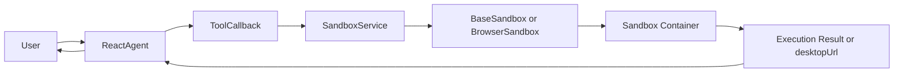

# 沙箱运行时（Sandbox）

大型语言模型能够决定“做什么”，但真正执行 Python、Shell 命令或浏览器操作时，仍然需要一个安全、可控、可回收的运行时环境。

这正是 **Sandbox** 的作用：它把工具执行放进隔离容器中，而不是直接暴露宿主机给 Agent。这样既能让 Agent 获得真实执行能力，也能保留会话隔离、生命周期管理和资源回收能力。

在 Spring AI Alibaba 中，Sandbox 常见于以下场景：

- 执行 Python 代码、Shell 命令等高风险操作
- 让 Agent 真实访问网页、点击页面、抓取信息
- 为每个请求或每个会话创建独立运行环境
- 将浏览器桌面通过 `desktopUrl` 暴露给前端进行实时预览

## 为什么需要 Sandbox

虽然模型具备 tool calling 能力，但它本身并不会直接执行系统命令。真正的执行链路通常是：

1. Agent 决定调用某个工具
2. 工具把请求交给 Sandbox 运行时
3. Sandbox 在隔离容器中执行代码、命令或浏览器操作
4. 执行结果再返回给 Agent 生成最终回答

如果没有 Sandbox，工具执行往往只能直接访问宿主机，这会带来几个明显问题：

- 缺少隔离，代码执行和命令执行风险高
- 会话难以管理，临时状态和运行环境不可控
- 浏览器自动化难以复用，也不容易向前端暴露可视化界面

## Sandbox 能力模型

Spring AI Alibaba 通过 `spring-ai-alibaba-sandbox-tool` 提供了与 Agent Framework 的接入能力。结合示例代码来看，核心能力可以分成两类：

| 类型 | 核心对象 | 典型工具 | 适用场景 |
| --- | --- | --- | --- |
| 通用执行沙箱 | `BaseSandbox` | `RunPythonCodeTool`、`RunShellCommandTool` | 代码执行、命令执行、一次性任务 |
| 浏览器沙箱 | `BrowserSandbox` | `BrowserNavigateTool` | 网页导航、表单填写、页面抓取、浏览器可视化 |

它们背后的生命周期由 `SandboxService` 统一管理，通常依赖 Docker 容器来提供隔离运行环境。

## 工作流程



对于浏览器场景，`BrowserSandbox` 除了返回执行结果外，还可以暴露 `desktopUrl`，供前端通过 iframe 或 VNC 面板实时查看沙箱中的浏览器桌面。

## 快速接入

### 添加依赖

两个示例模块都依赖了 Agent Framework、Sandbox Tool 和 DashScope Starter：

```xml
<dependency>
    <groupId>com.alibaba.cloud.ai</groupId>
    <artifactId>spring-ai-alibaba-agent-framework</artifactId>
</dependency>

<dependency>
    <groupId>com.alibaba.cloud.ai</groupId>
    <artifactId>spring-ai-alibaba-sandbox-tool</artifactId>
</dependency>

<dependency>
    <groupId>com.alibaba.cloud.ai</groupId>
    <artifactId>spring-ai-alibaba-starter-dashscope</artifactId>
</dependency>
```

### 基础配置

最基本的配置包括模型 API Key、Docker 连接地址和 Sandbox 池大小：

```yaml
spring:
  ai:
    dashscope:
      api-key: ${AI_DASHSCOPE_API_KEY:your-key-here}
      chat:
        options:
          model: qwen-max
          temperature: 0.7

sandbox:
  docker:
    host: "unix:///var/run/docker.sock"
  pool:
    size: 5
```

其中：

- `sandbox.docker.host` 指向 Docker socket
- `sandbox.pool.size` 控制预热容器数量
- `size: 0` 表示按需创建

:::info
在 macOS 上，Docker Desktop 的实际 socket 有时不在 `/var/run/docker.sock`，而是在 `${HOME}/.docker/run/docker.sock`。如果你遇到 Docker 连接失败，需要优先检查这个路径。
:::

## 实现方式一：执行型 Sandbox

如果你的目标是给 Agent 增加 Python、Shell 或基础浏览器能力，最直接的方式是参考 `sandbox-simple-tool` 模块。

这个示例的特点是：

- 使用一个标准 Spring Boot 应用暴露 REST API
- 每次请求创建一个新的 `ReactAgent`
- 在 Agent 上同时挂载业务工具和 Sandbox 工具
- 适合快速验证“模型 + 工具 + 沙箱执行”的最小闭环

### 1. 创建 SandboxService

`SandboxService` 负责容器生命周期管理。示例里通过 `DockerClientStarter` 和 `ManagerConfig` 完成初始化：

<Code
  language="java"
  title="创建 SandboxService" sourceUrl="https://github.com/alibaba/spring-ai-alibaba/tree/main/saa-example/spring-ai-alibaba-sandbox-example/sandbox-simple-tool/src/main/java/com/alibaba/cloud/ai/examples/sandbox/simple/config/SandboxConfiguration.java"
>
{`@Bean
public SandboxService sandboxService() {
    String normalizedDockerHost = normalizeDockerHost(dockerHost);
    DockerClientStarter dockerStarter = DockerClientStarter.builder()
            .host(normalizedDockerHost)
            .build();

    ManagerConfig managerConfig = ManagerConfig.builder()
            .clientStarter(dockerStarter)
            .build();

    this.sandboxService = new SandboxService(managerConfig);
    this.sandboxService.start();
    return this.sandboxService;
}`}
</Code>

这一步完成后，应用就拥有了管理沙箱容器的统一入口。

### 2. 把 Sandbox Tool 注册到 ReactAgent

接下来，在创建 `ReactAgent` 时，把 `BaseSandbox` 和 `BrowserSandbox` 包装成 Tool 注册进去：

<Code
  language="java"
  title="为 ReactAgent 注册 Sandbox Tool" sourceUrl="https://github.com/alibaba/spring-ai-alibaba/tree/main/saa-example/spring-ai-alibaba-sandbox-example/sandbox-simple-tool/src/main/java/com/alibaba/cloud/ai/examples/sandbox/simple/config/AgentConfiguration.java"
>
{`BaseSandbox baseSandbox = new BaseSandbox(
        sandboxService,
        "default-user",
        "session-" + System.currentTimeMillis()
);

tools.add(ToolkitInit.RunPythonCodeTool(baseSandbox));
tools.add(ToolkitInit.RunShellCommandTool(baseSandbox));

BrowserSandbox browserSandbox = new BrowserSandbox(
        sandboxService,
        "default-user",
        "session-" + System.currentTimeMillis()
);

tools.add(ToolkitInit.BrowserNavigateTool(browserSandbox));

return ReactAgent.builder()
        .name("SmartAssistant")
        .model(chatModel)
        .tools(tools)
        .build();`}
</Code>

这里体现了 Sandbox 接入的核心思路：

- `BaseSandbox` 负责 Python 和 Shell 这样的通用执行能力
- `BrowserSandbox` 负责网页导航和浏览器自动化
- `ToolkitInit.*Tool(...)` 负责把沙箱能力转成 Agent 可调用的 Tool

### 3. 暴露业务接口

示例的 `ChatController` 通过 `POST /api/chat` 接收请求，再由 `AgentService` 调用 `ReactAgent`：

```bash
curl -X POST http://localhost:8080/api/chat \
  -H "Content-Type: application/json" \
  -d '{"message":"Use Python to calculate 1+1"}'
```

你也可以直接查看当前服务暴露了哪些工具：

```bash
curl http://localhost:8080/api/chat/tools
```

这个模式适合：

- 快速搭建 PoC
- 给 Agent 增加执行代码/命令的能力
- 将 Sandbox 作为现有工具体系的一部分接入

## 实现方式二：会话化 Browser Sandbox

如果你的目标不是“一次性执行命令”，而是让 Agent 持续操作浏览器、维护会话上下文，并把浏览器画面实时展示给前端，那么更适合参考 `sandbox-browser-fullstack` 模块。

这个示例的特点是：

- 一个 `sessionId` 对应一个 `BrowserUseAgent`
- 每个会话拥有独立的 `BrowserSandbox`
- 通过 `SseEmitter` 向前端流式返回 Agent 输出
- 通过 `desktopUrl` 将沙箱浏览器桌面暴露给前端 VNC 面板

### 1. 按会话管理 Agent 与 Sandbox

示例通过 `SessionManager` 维护会话级 Agent 实例：

<Code
  language="java"
  title="按 sessionId 管理 BrowserUseAgent" sourceUrl="https://github.com/alibaba/spring-ai-alibaba/tree/main/saa-example/spring-ai-alibaba-sandbox-example/sandbox-browser-fullstack/src/main/java/com/alibaba/cloud/ai/examples/sandbox/browser/service/SessionManager.java"
>
{`private final Map<String, BrowserUseAgent> sessions = new ConcurrentHashMap<>();

public BrowserUseAgent getOrCreateAgent(String sessionId) {
    return sessions.computeIfAbsent(sessionId, id ->
            applicationContext.getBean(BrowserUseAgent.class)
    );
}`}
</Code>

这意味着不同用户或不同前端标签页可以拥有彼此隔离的浏览器上下文。

### 2. 初始化 BrowserSandbox 并注册 BrowserNavigateTool

在 `BrowserUseAgent` 中，真正的关键步骤是用 `sessionId` 初始化 `BrowserSandbox`，再把浏览器工具注册给 `ReactAgent`：

<Code
  language="java"
  title="初始化 BrowserSandbox" sourceUrl="https://github.com/alibaba/spring-ai-alibaba/tree/main/saa-example/spring-ai-alibaba-sandbox-example/sandbox-browser-fullstack/src/main/java/com/alibaba/cloud/ai/examples/sandbox/browser/agent/BrowserUseAgent.java"
>
{`browserSandbox = new BrowserSandbox(
        sandboxService,
        "browser-user",
        sessionId
);

agent = ReactAgent.builder()
        .name("BrowserAssistant")
        .model(chatModel)
        .instruction("""
                You are an intelligent web browsing assistant.
                You can navigate to web pages, extract information,
                fill out forms and perform web research.
                """)
        .tools(List.of(ToolkitInit.BrowserNavigateTool(browserSandbox)))
        .build();`}
</Code>

相比上一种模式，这里更强调“同一浏览器会话的持续复用”，而不是“每次请求临时起一个工具环境”。

### 3. 用 SSE 输出文本，用 Browser API 暴露桌面地址

这个示例把文本回复和浏览器预览拆成两条链路：

- `GET /api/chat/stream` 或 `POST /api/chat/stream`：流式返回 Agent 输出
- `GET /api/browser/info?sessionId=...`：返回当前浏览器会话的 `desktopUrl`

流式聊天接口示例：

```bash
curl "http://localhost:8080/api/chat/stream?sessionId=test-session&message=打开%20github.com%20并搜索%20spring-ai-alibaba"
```

查询浏览器桌面地址：

```bash
curl "http://localhost:8080/api/browser/info?sessionId=test-session"
```

前端拿到 `desktopUrl` 后，就可以在 VNC 面板或 iframe 中实时显示沙箱浏览器画面。

## 两个示例如何选择

| 需求 | 推荐示例 | 说明 |
| --- | --- | --- |
| 想快速验证 Python / Shell / Browser Tool | `sandbox-simple-tool` | 最小闭环，适合先跑通能力 |
| 想做带前端的网页操作 Agent | `sandbox-browser-fullstack` | 包含会话管理、SSE、浏览器预览 |
| 每次请求都独立执行 | `sandbox-simple-tool` | 更接近一次性任务 |
| 需要浏览器状态在会话中持续存在 | `sandbox-browser-fullstack` | `sessionId` 级别复用浏览器上下文 |

## 完整案例

仓库里可以直接参考这两个模块：

- `saa-example/spring-ai-alibaba-sandbox-example/sandbox-simple-tool`
- `saa-example/spring-ai-alibaba-sandbox-example/sandbox-browser-fullstack`

建议阅读顺序如下：

1. 先看 `sandbox-simple-tool`，理解 `SandboxService -> BaseSandbox/BrowserSandbox -> ToolkitInit -> ReactAgent`
2. 再看 `sandbox-browser-fullstack`，理解如何把 BrowserSandbox 变成“可持续的会话浏览器”

## 常见问题

### Docker 未启动

如果应用启动时报 Sandbox 初始化失败，先确认：

```bash
docker ps
```

只要 `docker ps` 能正常返回，说明 Docker 基本可用。

### macOS Docker Socket 路径不一致

如果日志里出现类似 “Failed to connect to Docker” 的错误，优先检查这两个路径：

```bash
ls -l /var/run/docker.sock || true
ls -l "${HOME}/.docker/run/docker.sock" || true
```

如果实际 socket 在 `${HOME}/.docker/run/docker.sock`，就把配置改成：

```yaml
sandbox:
  docker:
    host: "unix://${HOME}/.docker/run/docker.sock"
```

### 首次启动较慢

Sandbox 容器第一次启动时往往需要拉取镜像，因此首次请求比后续请求慢是正常现象。

### 浏览器地址为空

在 `sandbox-browser-fullstack` 中，通常需要先发起一次聊天请求完成 `BrowserSandbox` 初始化，`/api/browser/info` 才会返回有效的 `desktopUrl`。

## 小结

Sandbox 不是独立于 Agent 的另一套系统，而是 Agent Tool 执行链路中的隔离运行时。

如果你需要的是“让模型真正执行动作，但又不直接碰宿主机”，那就应该把执行能力落在 Sandbox 上：

- 用 `BaseSandbox` 处理 Python 和 Shell
- 用 `BrowserSandbox` 处理网页导航和浏览器自动化
- 用 `SandboxService` 管理生命周期
- 用 `ToolkitInit` 把运行时能力转换成 Agent 可调用的 Tool

在此基础上，你可以从 `sandbox-simple-tool` 快速起步，再演进到 `sandbox-browser-fullstack` 这种带会话和前端可视化的完整应用。
