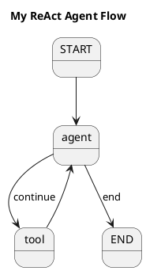
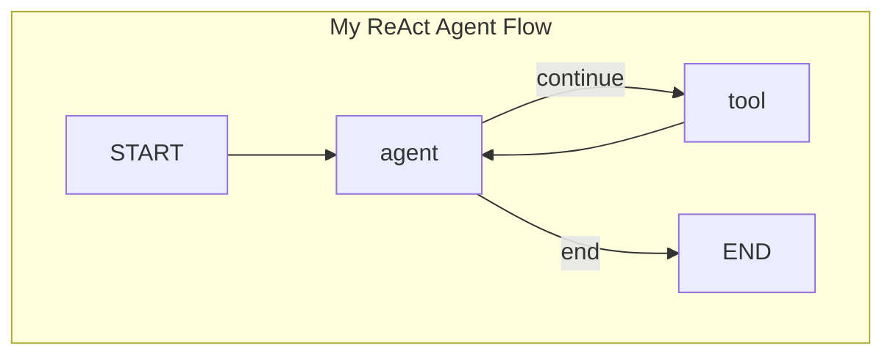

当您构建的 `StateGraph` 流程变得复杂时，纯粹通过代码来理解其节点连接和路由逻辑会变得越来越困难。为了解决这个问题，SAA Graph 内置了强大的图可视化功能，允许您将 `StateGraph` 对象（即您的“蓝图”）一键导出为通用的、人类可读的图表描述语言。

这对于以下场景至关重要：
-   **调试**: 在运行之前，直观地检查您的图结构是否符合预期，排查错误的节点连接。
-   **文档**: 将图表嵌入到您的技术文档或设计文档中，让其他人可以快速理解您的 Agent 工作流。
-   **沟通**: 在团队讨论中，使用可视化图表来展示和评审 Agent 的逻辑流程。

SAA Graph 目前支持两种主流的图表描述语言：**PlantUML** 和 **Mermaid**。

## 如何生成图表

可视化功能通过 `StateGraph` 对象上的 `getGraph()` 方法提供。这是一个非常简单直接的 API。

**核心 API**:
```java
GraphRepresentation stateGraph.getGraph(
    GraphRepresentation.Type type, 
    String title
);
```
-   `type`: 一个 `GraphRepresentation.Type` 枚举，用于指定输出格式。可选值为：
    -   `GraphRepresentation.Type.PLANTUML`
    -   `GraphRepresentation.Type.MERMAID`
-   `title`: 一个字符串，将作为生成图表的标题。

该方法会返回一个 `GraphRepresentation` 对象，您可以调用其 `.content()` 方法来获取生成好的、可以直接使用的图表描述字符串。

## 示例：导出 ReAct 逻辑图

让我们以《边与路由》章节中构建的 ReAct Agent 逻辑图为例，展示如何将其导出。

### 1. 导出为 PlantUML

PlantUML 是一种应用广泛的图表语言，有大量的工具和 IDE 插件支持渲染。

```java
// ... 假设您已经构建好了 reactGraph ...
StateGraph reactGraph = ...

// 调用 getGraph 方法生成 PlantUML 描述
GraphRepresentation representation = reactGraph.getGraph(
    GraphRepresentation.Type.PLANTUML, 
    "My ReAct Agent Flow"
);

// 打印生成的 PlantUML 字符串
System.out.println("--- PlantUML Diagram ---");
System.out.println(representation.content());
```

**输出的 `representation.content()` 将是如下格式的 PlantUML 字符串**:

您可以将这段文本粘贴到任何支持 PlantUML 的渲染器（如 PlantUML 在线服务器、VSCode 插件等）中，即可看到一个清晰的流程图。

### 2. 导出为 Mermaid

Mermaid 是另一种流行的、尤其在 Markdown 中得到广泛支持的图表语言（例如 GitHub、GitLab 都原生支持）。

```java
// ... 假设您已经构建好了 reactGraph ...
StateGraph reactGraph = ...

// 调用 getGraph 方法生成 Mermaid 描述
GraphRepresentation representation = reactGraph.getGraph(
    GraphRepresentation.Type.MERMAID, 
    "My ReAct Agent Flow"
);

// 打印生成的 Mermaid 字符串
System.out.println("--- Mermaid Diagram ---");
System.out.println(representation.content());
```

**输出的 `representation.content()` 将是如下格式的 Mermaid 字符串**:


您可以将这段文本直接嵌入到您的 Markdown 文件的代码块中（并指定语言为 `mermaid`），即可在支持的平台上自动渲染出流程图。

通过利用图可视化功能，您可以极大地提升开发和维护复杂 `StateGraph` 的效率和清晰度。建议您在开发过程中养成随时打印和查看图结构的习惯。
