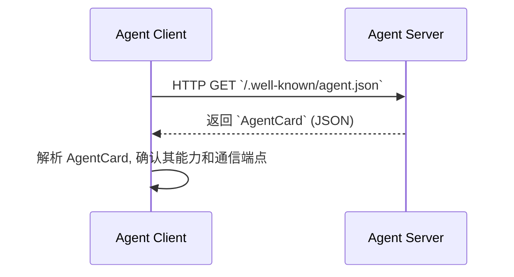
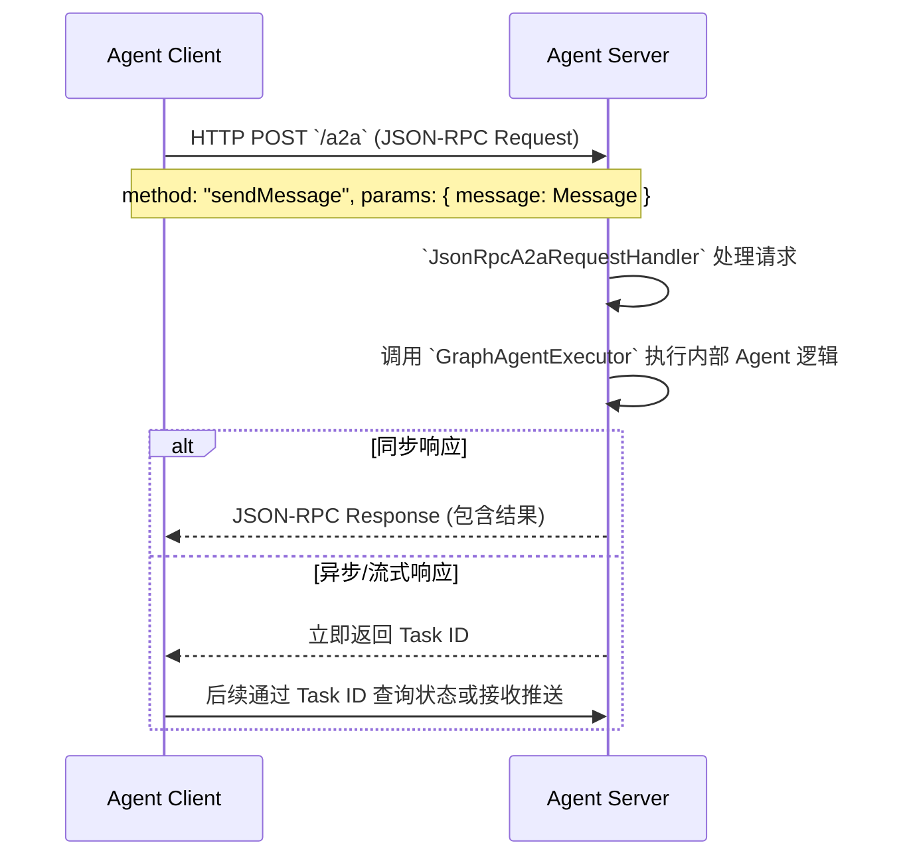

# A2A 协议基础

## 核心理念：智能体间的标准通信桥梁

A2A (Agent-to-Agent) 协议旨在让不同的 AI 智能体能够在分布式环境中进行高效、可靠的协作，就像微服务通过 API 相互调用一样简单。

A2A 协议的核心目标是：
- **互操作性**: 提供统一的智能体间通信接口，打破不同智能体实现之间的壁垒。
- **分布式**: 支持跨网络、跨服务的智能体协作，为构建大规模智能体系统提供基础。
- **可发现性**: 智能体可以发布自己的能力，并被其他智能体动态发现。

## 核心架构

A2A 的架构围绕“注册发现”和“直接通信”两个核心环节，主要包含以下角色：

#### 1. Agent Server (智能体服务器)
- **定义**: 实现了 A2A 协议，用于**暴露**自身能力的智能体实例。
- **职责**:
  - 实现具体的业务逻辑（例如，一个数据分析智能体）。
  - 通过标准端点暴露自己的 `Agent Card` (能力清单)。
  - 响应来自其他智能体的请求。

#### 2. Agent Registry (智能体注册中心)
- **定义**: 一个可选的、用于集中管理和发现智能体的服务，例如 Nacos。
- **职责**:
  - 存储已注册智能体的 `Agent Card` 或其元数据。
  - 帮助其他智能体根据能力需求，查询和发现目标智能体。

#### 3. Agent Client (智能体客户端)
- **定义**: **发起通信**的智能体。
- **职责**:
  - 查询注册中心或直接访问目标 Agent Server 来发现其能力和地址。
  - 根据 A2A 协议规范，向目标 Agent Server 发送请求。

### 架构关系图

智能体间的协作可以是简单的点对点通信，也可以是通过注册中心进行动态发现的复杂网络。

```mermaid
graph TD
    subgraph "分布式环境"
        ClientAgent[Agent Client<br/>(发起通信的智能体)]
        ServerAgent[Agent Server<br/>(提供服务的智能体)]
        Registry[(Agent Registry<br/>e.g., Nacos)]
    end
    
    ClientAgent -- "1. 发现 (可选)" --> Registry
    Registry -- "2. 返回目标 Agent 地址" --> ClientAgent
    ClientAgent -- "3. 直接通信" --> ServerAgent
    
    style Registry fill:#e1f5fe,stroke:#333,stroke-width:2px,stroke-dasharray: 5 5
```
**流程解释:**
1.  一个智能体 (Client) 如果需要某种能力，它可以先向注册中心查询。
2.  注册中心返回具备该能力的智能体 (Server) 的地址列表。
3.  Client 直接与 Server 建立连接并进行通信。在没有注册中心的简单场景下，Client 也可以通过静态配置直接与 Server 通信。

## 通信协议

A2A 模块默认提供了基于 **JSON-RPC 2.0** 的实现，运行在标准 HTTP 之上。

- **适用场景**: 具备广泛的跨语言兼容性，易于调试和理解。
- **特点**:
  - 基于 JSON 格式，结构清晰。
  - 严格的请求/响应规范，包含完整的错误处理机制。
  - 支持批量请求和通知。

**框架实现**:
- `JsonRpcA2aRequestHandler`: 服务端的核心处理器，负责解析 JSON-RPC 请求。
- `JsonRpcA2aRouterProvider`: 负责将 HTTP 请求路由到处理器，默认暴露两个标准端点：
  - `/.well-known/agent.json`: 用于获取智能体的 `Agent Card`。
  - `/a2a`: 用于处理智能体间的消息通信。

**配置示例**:
```yaml
spring:
  ai:
    alibaba:
      a2a:
        server:
          # 协议类型，当前默认为 jsonrpc
          type: jsonrpc
          # Agent Card 的暴露路径
          agent-card-url: /.well-known/agent.json
          # 消息处理的暴露路径
          message-url: /a2a
```

## A2A 核心数据结构

A2A 协议基于 `io.a2a.spec` 规范，定义了标准的数据结构。

### 1. Agent Card (智能体信息卡)

`AgentCard` 是智能体的“名片”，用于向外界声明自己的身份、能力和联系方式。

```json
{
  "name": "data-analysis-agent",
  "version": "1.0.0",
  "description": "一个专业的数据分析和洞察智能体。",
  "capabilities": [
    "data-analysis",
    "statistical-analysis", 
    "trend-prediction"
  ],
  "contact": {
    "endpoint": "http://agent.example.com/a2a",
    "protocols": ["jsonrpc"]
  }
}
```

### 2. Message (消息)

`Message` 是智能体间通信的基本单元。

```json
{
  "contextId": "conversation-123",
  "taskId": "task-456", 
  "parts": [
    {
      "kind": "text",
      "text": "请分析北京明天的天气趋势。"
    }
  ]
}
```
- `contextId`: 用于关联属于同一对话或上下文的多条消息。
- `taskId`: 用于追踪一个长时间运行的任务。
- `parts`: 消息的具体内容，可以是文本、图片等多种类型。

### 3. Task (任务)

`Task` 用于追踪一个需要较长时间处理的异步请求的状态。

```json
{
  "id": "task-456",
  "contextId": "conversation-123", 
  "status": {
    "state": "IN_PROGRESS", // e.g., SUBMITTED, IN_PROGRESS, COMPLETED, FAILED
    "progress": 0.6,
    "updatedAt": "2024-12-05T10:30:00Z"
  },
  "messages": [ /* 相关的消息历史 */ ],
  "artifacts": [ /* 任务产出的结果，如文件、报告等 */ ]
}
```

## 通信流程

### 智能体发现与初始化



### JSON-RPC 工具调用流程



## 核心特性

Spring AI Alibaba A2A 模块的核心是**将一个基于 SAA Graph 构建的 `BaseAgent` 实例包装并暴露为标准的 A2A 服务**。

- **Graph Agent 集成**: 通过 `GraphAgentExecutor`，A2A 模块可以将外部的 A2A 请求无缝转换为对内部 `BaseAgent` (如 `ReactAgent`) 的调用。
- **自动注册与发现**: 通过 `AgentRegistry` 接口，可以轻松集成 Nacos 等注册中心，实现智能体的动态发现。
- **流式响应支持**: 对于长时间运行的 Agent 任务，A2A 协议支持通过流式响应（SSE）或任务轮询的方式，实时反馈进度和结果。
- **标准化**: 遵循 `io.a2a` 协议规范，确保了与其他同样遵循该规范的智能体系统的互操作性。

## 下一步

现在您已经了解了 A2A 协议的基础概念，接下来可以：

- **[快速入门：构建你的第一个 A2A 智能体](./registry)**: 学习如何将一个本地智能体暴露为 A2A 服务。
- **[跨智能体通信模式](./communication)**: 掌握智能体间的具体通信模式和客户端实现。
