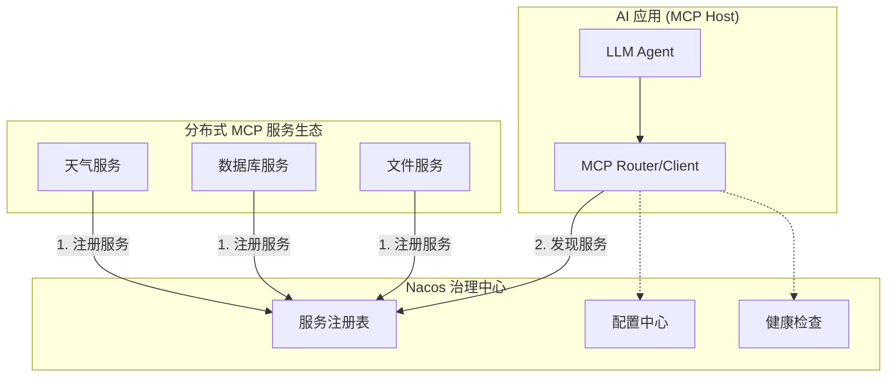

# Nacos 服务注册与发现

## 概述

当您的 AI 工具需要以微服务形式部署时，服务的治理就变得至关重要。Spring AI Alibaba MCP 通过与 [Nacos](https://nacos.io/) 的深度集成，提供了生产级的分布式 MCP 服务管理能力。

在这个架构中，Nacos 扮演着“注册中心”和“配置中心”的角色：
- **服务注册**: MCP Server 启动时，会自动将其服务地址和能力元数据（提供了哪些工具等）上报给 Nacos。
- **服务发现**: MCP Client (您的 AI 应用) 向 Nacos 查询可用的 MCP Server 列表，并动态连接到它们。
- **动态配置**: 您可以通过 Nacos 控制台动态地更新工具的配置（如启用/禁用某个工具），而无需重启服务。

这种“MCP on Nacos”的架构，为构建**可扩展、高可用、可动态治理**的企业级 AI 工具生态提供了坚实的基础。

## 架构原理



## 1. 创建可注册的 MCP Server

让我们以 `mcp-quickstart` 中的计算器服务为例，将其改造为一个可以通过 Nacos 注册的分布式服务。

### a. 添加依赖

在 `pom.xml` 中，我们需要 `spring-ai-alibaba-starter-nacos-mcp-server` 和 `spring-ai-starter-mcp-server-webmvc`。

```xml
<dependencies>
    <!-- 核心依赖：SAA MCP Nacos Server -->
    <dependency>
        <groupId>com.alibaba.cloud.ai</groupId>
        <artifactId>spring-ai-alibaba-starter-nacos-mcp-server</artifactId>
        <version>${spring-ai-alibaba.version}</version>
    </dependency>
    
    <!-- MCP Server WebMVC 支持 (暴露 SSE 端点) -->
    <dependency>
        <groupId>org.springframework.ai</groupId>
        <artifactId>spring-ai-starter-mcp-server-webmvc</artifactId>
    </dependency>

    <!-- Web 环境 -->
    <dependency>
        <groupId>org.springframework.boot</groupId>
        <artifactId>spring-boot-starter-web</artifactId>
    </dependency>
</dependencies>
```

### b. 编写工具代码

工具代码 (`CalculatorService.java` 和主应用类) 与 `mcp-quickstart` 中的 Nacos 示例完全相同，此处不再赘述。

### c. 配置 Nacos 注册

`application.yml` 是配置的关键。我们需要配置服务的基本信息、SSE 端点以及 Nacos 的连接信息。

```yaml
server:
  port: 9001

spring:
  application:
    name: calculator-mcp-server
  # 1. 配置 MCP Server 自身信息
  ai:
    mcp:
      server:
        name: calculator-server
        version: 1.0.0
        type: ASYNC
        instructions: "一个提供基本数学运算的计算器服务"
        sse-message-endpoint: /mcp/messages
        capabilities:
          tool: true
    # 2. SAA 为 MCP Nacos 提供的专属配置
    alibaba:
      mcp:
        nacos:
          server-addr: 127.0.0.1:8848
          username: nacos
          password: nacos
          registry:
            enabled: true
            # 建议将所有 MCP 服务放在同一个分组下
            service-group: mcp-server
            # service-name 默认会使用 mcp.server.name 的值
            service-name: calculator-server
```

### d. 启动并验证

启动该 Spring Boot 应用。如果 Nacos 正在运行且配置正确，服务启动后会自动完成注册。

登录 Nacos 控制台 (`http://localhost:8848/nacos`)，您会看到：
1.  **服务列表**: 在 `mcp-server` 分组下，出现了一个名为 `calculator-server` 的服务实例，IP 和端口正确，状态为“健康”。
2.  **配置列表**: SAA 自动为您创建了两个配置文件：
    *   `calculator-server-mcp-server.json`: 存储了服务的元数据（描述、版本、端点等）。
    *   `calculator-server-mcp-tools.json`: 存储了该服务提供的所有工具的详细定义（名称、描述、输入参数等）。

## 2. 创建通过 Nacos 发现服务的 MCP Client

Client 应用现在不再需要硬编码 Server 的地址或启动命令，而是向 Nacos 查询所需的服务。

### a. 添加依赖

Client 端需要 `spring-ai-alibaba-starter-nacos-mcp-client` 和相应的 LLM 依赖。

```xml
<dependencies>
    <!-- 核心依赖：SAA MCP Nacos Client -->
    <dependency>
        <groupId>com.alibaba.cloud.ai</groupId>
        <artifactId>spring-ai-alibaba-starter-nacos-mcp-client</artifactId>
        <version>${spring-ai-alibaba.version}</version>
    </dependency>
    
    <!-- DashScope LLM -->
    <dependency>
        <groupId>com.alibaba.cloud.ai</groupId>
        <artifactId>spring-ai-alibaba-starter-dashscope</artifactId>
    </dependency>
</dependencies>
```

### b. 配置 Nacos 发现

在 Client 的 `application.yml` 中，我们配置需要从 Nacos 发现哪些服务。

```yaml
spring:
  application:
    name: nacos-mcp-client
  # 1. 配置 DashScope API Key
  ai:
    dashscope:
      api-key: ${AI_DASHSCOPE_API_KEY}
    # 2. SAA MCP Nacos Client 专属配置
    alibaba:
      mcp:
        nacos:
          server-addr: 127.0.0.1:8848
          username: nacos
          password: nacos
          client:
            enabled: true
            sse:
              # 关键：配置需要连接的服务
              connections:
                # key (e.g., server1) 是自定义的连接标识
                server1:
                  # value 是要发现的服务的 service-name
                  service-name: calculator-server

server:
  port: 9002
```
**代码解释:**
- `spring.ai.alibaba.mcp.nacos.client.sse.connections`: 在这里配置一个 Map，key 是你为这个连接起的任意名称，value 中的 `service-name` 则是要从 Nacos 发现的服务名。

### c. 运行并测试

启动 Client 应用。它会自动连接 Nacos，找到 `calculator-server` 的地址，建立 SSE 连接，然后 `ChatClient` 就可以使用计算器工具了。

## 3. 动态配置管理

Nacos 的强大之处不仅在于服务发现，更在于其动态配置能力。您可以**在不重启 MCP Server 的情况下，通过 Nacos 控制台动态修改工具的行为**。

### a. 热更新工具元信息

进入 Nacos 配置列表，找到 `calculator-server-mcp-tools.json` 文件。假设我们想**临时禁用** `multiply` 工具。可以直接编辑该 JSON 文件：

```json
{
  "tools": [ ... ],
  "toolsMeta": {
    "add": {
      "enabled": true
    },
    "multiply": {
      // 将 enabled 从 true 改为 false
      "enabled": false
    }
  }
}
```
点击“发布”，几秒钟后，Server 会自动收到配置更新，`multiply` 工具将不再对 Client 可用，而整个过程服务并未中断。

### b. 实现配置监听器

您可以在 Server 端实现一个 `@NacosConfigListener` 来监听配置文件的变更，从而执行更复杂的自定义逻辑。

```java
@Component
public class McpConfigListener {
    private static final Logger logger = LoggerFactory.getLogger(McpConfigListener.class);

    @NacosConfigListener(dataId = "${spring.ai.mcp.server.name}-mcp-tools.json", 
                        autoRefreshed = true)
    public void onToolsConfigChange(String configInfo) {
        logger.info("检测到工具配置已更新: {}", configInfo);
        // 在这里可以添加自定义逻辑，例如根据新的配置更新内部状态
    }
}
```

## 4. 健康检查与监控

MCP on Nacos 方案内置了健康检查机制。当一个 MCP Server 实例出现问题（例如进程崩溃或网络不通），Nacos 会将其标记为“不健康”，Client 将自动从可用实例列表中移除它，从而实现服务调用的高可用。

您可以通过 Actuator 端点暴露更详细的自定义健康检查信息。

```java
@Component
public class McpHealthIndicator implements HealthIndicator {
    private final McpServerManager mcpServerManager;
    // ... 构造函数注入 ...

    @Override
    public Health health() {
        boolean isHealthy = mcpServerManager.isHealthy();
        if (isHealthy) {
            return Health.up()
                .withDetail("active-connections", mcpServerManager.getActiveConnections())
                .build();
        } else {
            return Health.down()
                .withDetail("error", mcpServerManager.getLastError())
                .build();
        }
    }
}
```
同时，框架也通过 Micrometer 暴露了丰富的监控指标，您可以将其对接到 Prometheus 等监控系统，实现对工具调用成功率、耗时等关键指标的监控和告警。

## 下一步

- **[MCP Router 智能路由](./mcp-router)**: 学习如何构建一个更智能的网关层，它可以使用向量数据库来根据用户的自然语言描述，自动从 Nacos 中发现的众多服务里选择最合适的工具进行调用。
