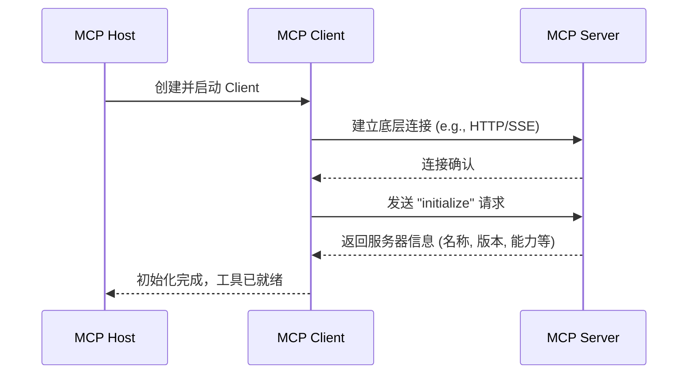
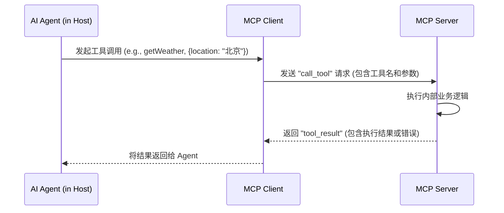

# MCP 协议基础

## 核心理念：AI 应用的 “USB-C” 端口

理解 MCP (Model Context Protocol) 最快的类比是：**MCP 就是 AI 应用的 “USB-C” 端口**。

就像 USB-C 为不同的电子设备提供了统一的充电和数据传输接口一样，MCP 旨在为不同的 AI 应用和外部系统（工具、数据源、工作流）之间提供一个**开放的、标准的连接协议**。它的核心目标是打破当前 AI 工具生态的“孤岛”，实现真正的互联互通。

本篇文章将深入 MCP 的技术细节，帮助您理解其工作原理。

## 核心架构

### 参与者角色

MCP 采用标准的客户端-服务器架构，包含三个核心角色：

#### 1. MCP Host (宿主)
- **定义**: **AI 应用本身**，例如我们用 SAA 构建的智能体应用。
- **职责**: 
  - 管理一个或多个 MCP Client 实例。
  - 协调与不同 MCP Server 的通信。
  - 为 AI Agent 提供统一的工具调用接口。

#### 2. MCP Client (客户端)
- **定义**: 用于**连接**并消费单个 MCP Server 能力的组件。
- **职责**:
  - 与特定的 MCP Server 建立和管理连接。
  - 处理协议层面的消息序列化与反序列化。

#### 3. MCP Server (服务器)
- **定义**: 一个实现了 MCP 规范、用于**暴露**自身能力（工具、数据等）的程序。
- **职责**:
  - 提供具体的工具函数实现。
  - 响应来自 Client 的请求。
  - 管理自身资源和状态。

### 架构关系图

一个 Host (你的 AI 应用) 为每一个需要连接的 Server (外部工具) 都创建一个对应的 Client，并通过这个 Client 与 Server 进行通信。

```mermaid
graph TB
    Host[MCP Host<br/>(你的 AI 应用)] --> Client1[MCP Client 1]
    Host --> Client2[MCP Client 2]
    Host --> ClientN[MCP Client N]
    
    Client1 --> Server1[MCP Server 1<br/>(天气服务)]
    Client2 --> Server2[MCP Server 2<br/>(数据库服务)]
    ClientN --> ServerN[MCP Server N<br/>(文件服务)]
    
    subgraph "Spring AI Alibaba 应用内部"
        Host
        Client1
        Client2
        ClientN
    end
    
    subgraph "外部工具生态"
        Server1
        Server2
        ServerN
    end
```

## 支持的通信协议

Spring AI Alibaba MCP 支持多种底层通信协议，以满足不同场景的需求。

### 1. STDIO (标准输入/输出)
- **适用场景**: 本地开发、简单进程间通信、CLI 工具集成。
- **特点**: 
  - 轻量级，无需网络配置，启动迅速。
  - AI 应用的生命周期与工具进程的生命周期绑定。
  - 非常适合将现有的命令行工具封装为 MCP Server。

**示例配置 (Server 端)**:
```yaml
spring:
  main:
    # 禁用 Web 环境
    web-application-type: none
    banner-mode: off
  ai:
    mcp:
      server:
        name: my-local-tool-server
        version: 0.0.1
# 禁用控制台日志以保证 STDIO 信道纯净
logging:
  pattern:
    console: ""
```

### 2. SSE (Server-Sent Events)
- **适用场景**: Web 应用、分布式微服务、需要实时消息推送的场景。
- **特点**:
  - 基于标准 HTTP 协议，易于调试和代理。
  - 支持从 Server 到 Client 的单向实时消息推送。
  - 是构建分布式、高可用工具服务的推荐方式。

**示例配置 (Server 端)**:
```yaml
spring:
  ai:
    mcp:
      server:
        # 暴露 SSE 端点
        sse-message-endpoint: /mcp/messages
        # 使用异步模式
        type: ASYNC
```

## MCP 原语 (Primitives)

MCP 协议定义了三种核心“原语”，用于描述 Server 可以向外提供的能力类型。

### 1. 工具 (Tools)
- **定义**: 可被远程执行的函数。这是最核心、最常用的能力。
- **特点**:
  - 支持丰富的参数类型和数据结构。
  - 框架自动处理参数的校验和绑定。
  - 提供标准的异常处理机制。

**示例 (Server 端)**: 
```java
@Tool(description = "获取指定经纬度的天气预报")
public WeatherInfo getWeatherForecastByLocation(
    @ToolParam(description = "纬度") double latitude,
    @ToolParam(description = "经度") double longitude) {
    // ... 调用天气服务 API 并返回结构化数据
    return weatherInfo;
}
```
**代码解释:**
- `@Tool` 注解将一个 Java 方法声明为一个可供远程调用的 MCP 工具。
- `@ToolParam` 注解用于描述方法的参数，这些描述将提供给 LLM，帮助它理解如何正确调用该工具。

### 2. 资源 (Resources)
- **定义**: 可被远程读取的数据源，通常是只读的。
- **特点**:
  - 允许 AI 应用获取用于构建上下文或进行 RAG (检索增强生成) 的知识。
  - 支持版本控制和缓存机制。

**示例**:
- 数据库的 Schema 定义 (`/resources/db/schema.json`)
- 知识库中的一篇文章 (`/resources/kb/article-123.md`)
- 一份配置文件 (`/resources/config/settings.yaml`)

### 3. 提示 (Prompts)
- **定义**: 可被远程获取、可复用的提示词模板。
- **特点**:
  - 实现了“能力”与“使用说明”的绑定。工具的提供方可以同时提供与该工具配合使用的最佳提示。
  - 支持模板参数化和上下文绑定。

**示例**: 一个用于生成 SQL 查询的提示模板 (`/prompts/sql-generator`)
```
根据以下数据库 Schema 定义来生成一条 SQL 查询:

数据库 Schema:
{schema}

用户的查询需求是:
{requirement}
```

## 消息流程

### 初始化流程

当一个 Client 首次连接 Server 时，会进行初始化握手，以获取 Server 的基本信息和能力清单。



### 工具调用流程

初始化完成后，Host 就可以通过 Client 调用 Server 上的工具了。



## 错误处理与恢复

MCP 定义了一套标准的错误处理机制，并建议实现者提供恢复策略。

### 常见错误类型

1.  **连接错误**: 网络中断、进程意外退出。
2.  **协议错误**: 消息格式错误、协议版本不兼容。
3.  **工具错误**: 工具执行过程中发生的业务逻辑异常。
4.  **超时错误**: 请求在规定时间内未得到响应。

### 恢复策略示例

Spring AI 提供了强大的重试和恢复机制，可以与 MCP 无缝集成。例如，您可以利用 Spring Retry 库，在 Client 端为工具调用增加自动重试逻辑，并在多次失败后执行降级策略（如返回一个友好的错误提示），从而提升系统的健壮性。

```java
// 示意代码：在 Client 端为工具调用增加自动重试
@Retryable(value = {Exception.class}, maxAttempts = 3, backoff = @Backoff(delay = 1000))
public String callRemoteTool(String toolName, Map<String, Object> args) {
    // ... 调用 MCP Client 的逻辑 ...
    // 如果 MCP Client 抛出异常，Spring Retry 会自动重试
}

// 示意代码：定义一个降级方法，在重试失败后调用
@Recover
public String recoverFromMcpError(Exception ex, String toolName) {
    log.error("调用工具 {} 失败，已触发降级", toolName, ex);
    return "服务暂时不可用，请稍后重试";
}
```

## 性能与安全

### 性能优化
- **连接池**: 对于 SSE 等基于网络的协议，Client 会维护一个连接池以减少连接开销。
- **缓存**: Client 和 Server 可以在多个层面添加缓存，例如缓存工具定义、资源内容等。
- **监控**: 框架暴露了丰富的监控指标，如连接数、请求延迟、错误率等，可对接 Prometheus 等监控系统。

### 安全保障
- **认证**: 支持 API Key、OAuth 2.0、mTLS 等多种认证机制，确保只有合法的客户端可以连接。
- **授权**: 可在工具层面定义所需的权限，进行细粒度的访问控制。
- **数据保护**: 支持 TLS 传输加密，并提供参数过滤和验证机制。

## 下一步

现在您已经理解了 MCP 的核心概念，是时候动手实践了！

- **[MCP 快速上手](./mcp-quickstart)** - 跟随教程，构建您的第一个本地和分布式 MCP 应用。
